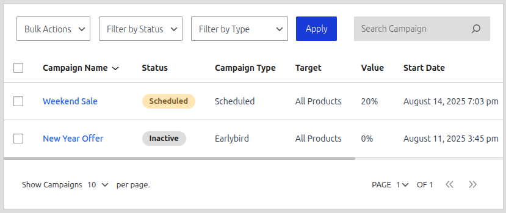

# Early Bird Discounts

The "Early Bird" campaign is one of the most powerful marketing tools in CampaignBay for creating **urgency** and **FOMO (Fear Of Missing Out)**. It allows you to offer tiered discounts that are available to a limited number of customers.

Unlike a Quantity Discount, which is based on the number of items in a single person's cart, an Early Bird discount is based on the **total number of successful orders** that have already used the campaign across your entire store.

**Example:** "The first 50 customers to order get 30% off! The next 100 customers get 15% off."

## Use Cases

-   **New Product Launches:** Reward your first buyers and generate immediate sales velocity and social proof.
-   **Flash Sales:** Drive a massive amount of traffic in a short period by creating a race to the checkout.
-   **Rewarding VIPs:** Offer a special, limited-slot discount to your most loyal email subscribers.

## Configuration Steps

### 1. Select the Campaign Type

From the "Add Campaign" screen, select **"EarlyBird Discount"** from the "SELECT DISCOUNT TYPE" dropdown.

<!--  -->

### 2. Configure Common Fields

Set the **Campaign Title**, **Target** (e.g., "Specific Products"), and **Campaign Duration**. While an Early Bird campaign can expire when all slots are claimed, it's a best practice to also set a final **End Date** for the promotion.

### 3. Define the Early Bird Tiers

This is the primary configuration for an Early Bird Discount. You will define one or more tiers based on the order count.

Let's break down the fields for a single tier:

-   **Up to first (Max Orders):** This is the most important field. It defines the maximum number of **total orders** that can receive this tier's discount. For "the first 100 orders," you would enter `100`.
-   **orders, get (Value):** The discount value for this tier.
-   **Type (% or Fixed):** Choose whether the discount is a percentage or a fixed amount.
-   **+ Add another tier:** Click this to add more tiers.

### Example Scenario & Setup

Let's say you are launching a new product and want to create a tiered offer to drive initial sales:
-   The first **100 orders** get **25% off**.
-   The next **200 orders** (i.e., orders 101 through 300) get **10% off**.

Your tier configuration would look like this:

-   **Tier 1:** Max Orders `100`, Value `25`, Type `%`
-   **Tier 2:** Max Orders `300`, Value `10`, Type `%`

### 4. How it Works for Customers

The plugin automatically tracks the number of successful orders that have used this campaign.

-   When the **1st customer** places their order, the system checks the usage count (which is `0`). Since `0` is less than `100`, they qualify for the first tier and receive a 25% discount.
-   When the **150th customer** places their order, the system checks the usage count (which is `149`). `149` is not less than `100`, so they do not get the first tier. However, `149` is less than `300`, so they qualify for the second tier and receive a 10% discount.
-   When the **301st customer** places their order, the usage count is `300`. Since this is not less than any of the tier maximums, they will not receive an Early Bird discount. The campaign is now fully claimed.

### 5. How it Appears on the Product Page

To maximize urgency, the Early Bird campaign can display a notice on the product page showing how many discounts are left, or a countdown. This clearly communicates the scarcity of the offer to potential buyers.

<!--  -->

## What's Next?

You have now learned about all the major campaign types in CampaignBay. The next step is to understand the "All Campaigns" screen, which is your central hub for managing, filtering, and performing bulk actions on all the campaigns you've created.

**➡️ Next Step: [Learn About Managing Your Campaigns](../managing-campaigns/all-campaigns-screen.md)**