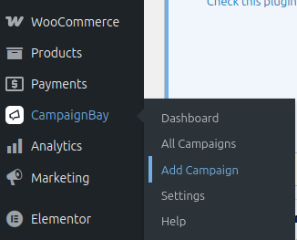
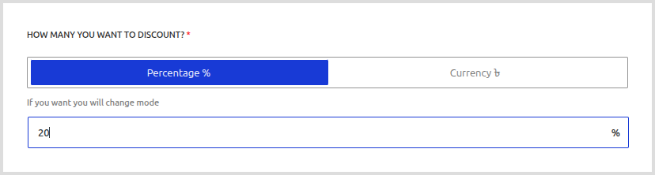

# Your First Campaign (Scheduled Discount)

This guide provides a detailed, step-by-step walkthrough for creating the most common and straightforward type of discount: a **Scheduled Discount**. This campaign type is the foundation for most time-based sales, like holiday promotions or weekend flash sales.

Our goal in this tutorial is to create a **"20% Off Weekend Sale"** for all products on the store.

## 1. Navigate to Add Campaign

In your WordPress admin menu, find the main **Campaigns** item. Click on it, and then select **Add Campaign**. This will take you to the main campaign editor screen where you will configure all your discounts.

## 2. Select the Campaign Type

This is the most important setting, as it defines how your discount will behave. Click on the **"SELECT DISCOUNT TYPE"** dropdown menu. For this tutorial, select the **"Scheduled Discount"** option.

## 3. Set the Campaign Title

In the **"CAMPAIGN TITLE"** field, give your campaign a clear and descriptive name. This title is important because it will be shown to customers in the cart totals section, so make it something they will understand, like `Weekend Sale`.

## 4. Choose the Target

The **"SELECT FOR USERS"** field determines which products are eligible for the discount. For this first campaign, we want to apply the discount to everything in the store. Ensure that **"Entire Store"** is selected. This is the simplest and broadest targeting option.

## 5. Define the Discount Value

In this section, you will set the amount of the discount.
1.  In the input field, type `20`.
2.  Ensure the **`%`** button next to the field is highlighted and blue. This sets the discount type to a percentage.

This configures a 20% discount that will be applied to the price of every eligible product.

## 6. Set the Schedule

Because this is a "Scheduled Discount," you must provide a start and end date. The **"Enable Scheduling"** toggle will be automatically turned on and locked, as a schedule is required for this campaign type.

1.  **Start Time / Date:** Click the time and date fields to open the pickers. Select the date and time you want the sale to begin (e.g., Friday at 12:01 AM).
2.  **End Time / Date:** Select the date and time you want the sale to end (e.g., Sunday at 11:59 PM).

The schedule will run based on the timezone you have set in your main WordPress settings (`Settings > General`).

## 7. Save the Campaign

Once all your settings are configured, click the blue **"Save Campaign"** button.

## 8. Verify in the Admin

After saving, you will be automatically redirected to the "All Campaigns" list. You should see your new "Weekend Sale" campaign at the top of the table.

Because its start date is in the future, its status will be a yellow **"Scheduled"** pill. This confirms that the system has correctly saved and scheduled your campaign. The Scheduler will automatically change this to "Active" when the start date arrives.

## 10. Verify on the Frontend (Optional)

If you set the start date to a time in the past to make the campaign active immediately, you can visit your shop page. You will see the discounted prices displayed, often with the original price crossed out. This is the ultimate confirmation that your campaign is working correctly.

<!--  -->

## What's Next?

Congratulations! You've mastered the **Scheduled Discount**.

Now that you understand the basic workflow, let's explore the more advanced campaign types that can help you create even more powerful promotions.

*   **➡️ Learn about [Quantity Based Discounts](./quantity-discounts.md)**
*   **➡️ Learn about [Early Bird Discounts](./earlybird-discounts.md)**