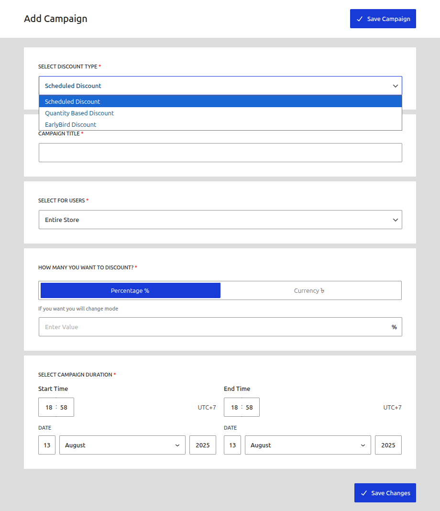
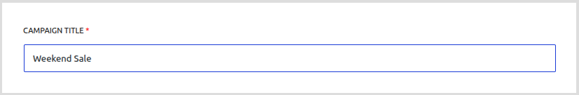
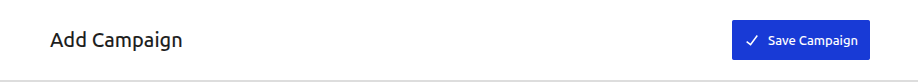
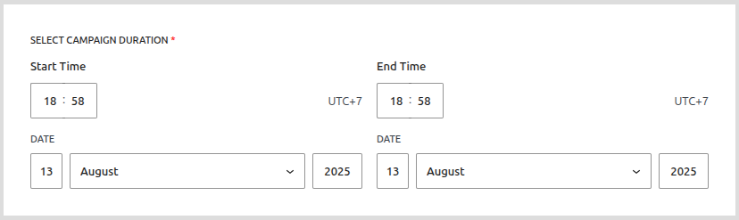
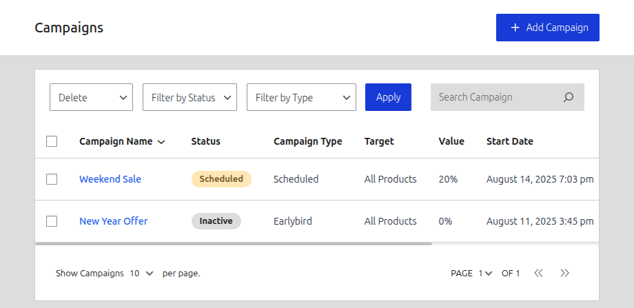
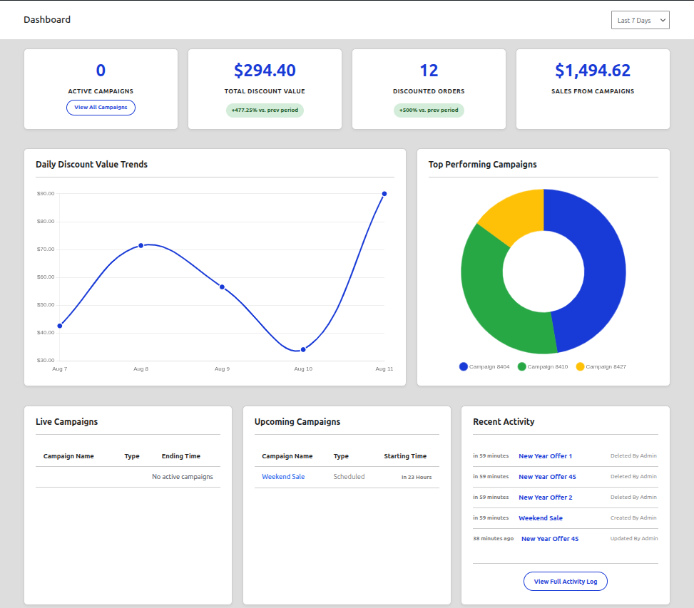

# Creating Your First Campaign: Scheduled Discount

This tutorial will guide you through creating your first CampaignBay campaign - a **Scheduled Discount**. This is the perfect starting point for beginners as it covers the foundational concepts that apply to all campaign types.

## What is a Scheduled Discount?

A **Scheduled Discount** is the foundational campaign type in CampaignBay, ideal for creating traditional sales events like "Black Friday," "Summer Clearance," or weekend flash sales. It applies a direct price reduction (either a fixed amount or a percentage) to eligible products during a specified time period.

**Key Features:**

- **Time-based Activation**: Automatically starts and stops based on your schedule
- **Flexible Discount Types**: Percentage or fixed amount discounts
- **Precise Targeting**: Apply to specific products, categories, or your entire store
- **Automated Management**: No manual intervention required once set up

## Before You Begin

Make sure you have:

- ✅ CampaignBay plugin installed and activated
- ✅ WooCommerce configured with at least one product
- ✅ Access to your WordPress admin dashboard

## Step-by-Step Campaign Creation

### Step 1: Access the Campaign Creation Screen

1. Navigate to **Campaigns > Add Campaign** in your WordPress admin menu
2. You'll see the campaign creation form with several sections

### Step 2: Select Campaign Type

From the "SELECT DISCOUNT TYPE" dropdown, choose **"Scheduled Discount"**.

### Step 3: Configure Basic Campaign Information

Fill in the essential campaign details:

**Campaign Title**

- Enter a descriptive name (e.g., "Summer Sale 2024" or "Weekend Flash Sale")
- This title will be visible in your admin dashboard and can be used in customer communications

**Target Selection**
Choose where your discount will apply:

- **Entire Store**: Applies to all products (use sparingly for major sales)
- **Specific Products**: Select individual products for targeted promotions
- **Specific Categories**: Apply to all products within selected categories

### Step 4: Set Campaign Duration

Configure when your campaign will be active:

**Start Date & Time**

- Set when the campaign should begin
- Use the date picker to select your desired start date
- Set a specific time for precise control

**End Date & Time**

- Set when the campaign should end
- Leave blank for ongoing campaigns
- Consider your timezone settings

### Step 5: Configure Discount Details

**Discount Type**
Choose between:

- **Percentage**: Reduces price by a percentage (e.g., 20% off)
- **Fixed Amount**: Reduces price by a specific dollar amount (e.g., $10 off)

**Discount Value**

- For percentage: Enter the discount percentage (e.g., 20 for 20% off)
- For fixed amount: Enter the dollar amount (e.g., 10 for $10 off)

**Important Notes:**

- Percentage discounts are calculated from the regular price
- Fixed amount discounts are deducted from the regular price
- The final price cannot go below zero

### Step 6: Review and Save

Before saving, review your campaign configuration:

**Checklist:**

- ✅ Campaign type selected correctly
- ✅ Title is descriptive and clear
- ✅ Target scope is appropriate
- ✅ Start and end dates are correct
- ✅ Discount type and value are set correctly

**Save Your Campaign**
Click the "Save Campaign" button to create your first campaign.

## What Happens Next?

### Automatic Status Management

Once saved, your campaign will automatically transition through different statuses:

1. **Scheduled**: Campaign is created but not yet active
2. **Active**: Campaign is running and applying discounts
3. **Expired**: Campaign has ended (if end date was set)

### Customer Experience

When your campaign becomes active:

- **Product Pages**: Show discounted prices with strikethrough original prices
- **Shop Pages**: Display sale prices and "Sale!" badges
- **Cart**: Automatically applies discounts to eligible products
- **Checkout**: Final prices reflect all active discounts

## Verifying Your Campaign

### Check Campaign Status

1. Go to **Campaigns > All Campaigns**
2. Find your campaign in the list
3. Verify the status shows as expected

### Test Customer Experience

1. Visit your store as a customer
2. Navigate to products included in your campaign
3. Verify discounted prices are displayed correctly
4. Add products to cart and verify discounts apply

## Advanced Configuration Options

### Campaign Stacking

If you plan to run multiple campaigns simultaneously:

- **Enable Stacking**: Allows multiple campaigns to apply to the same product
- **Conflict Resolution**: Choose how to handle overlapping discounts
- **Priority Settings**: Control which discounts take precedence

### Performance Optimization

- **Enable Caching**: Improves page load times (recommended)
- **Debug Mode**: Enable for troubleshooting (disable in production)

## Troubleshooting Common Issues

**Campaign Not Active:**

- Check start date and time
- Verify campaign status in admin dashboard
- Ensure WooCommerce is active

**Discounts Not Applying:**

- Verify product targeting is correct
- Check if products are excluded from sales
- Enable debug mode to view logs

**Performance Issues:**

- Enable discount caching
- Check for conflicting plugins
- Review server resources

## Next Steps

Congratulations! You've successfully created your first CampaignBay campaign. Here's what to explore next:

**Immediate Actions:**

- Monitor your campaign performance
- Test the customer experience
- Adjust settings if needed

**Advanced Features:**

- [Quantity Based Discounts](./quantity-discounts.md) - Create tiered pricing for bulk purchases
- [Early Bird Discounts](./earlybird-discounts.md) - Drive urgency with limited-time offers
- [Campaign Management](/managing-campaigns/all-campaigns-screen) - Learn to manage multiple campaigns

**Optimization:**

- [Settings Configuration](/reference/settings) - Fine-tune plugin behavior
- [Dashboard Overview](/getting-started/dashboard-overview) - Monitor campaign performance

---

_You're now ready to create powerful, automated discount campaigns that drive sales and engage customers!_
