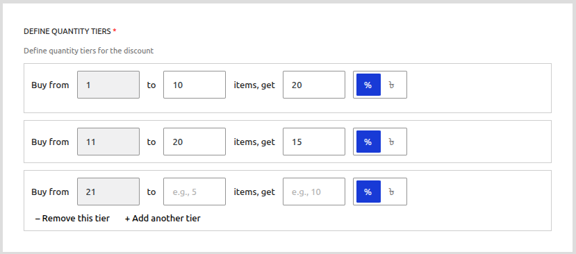
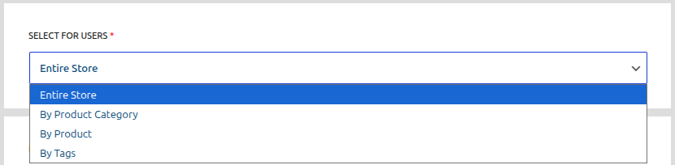
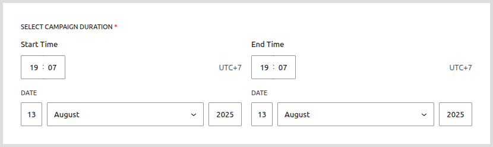
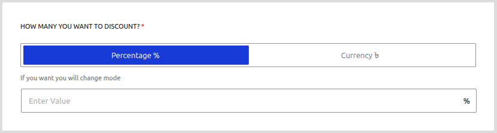

# Quantity Based Discounts

Quantity-based discounts are a powerful way to incentivize customers to buy in bulk. This campaign type allows you to create **tiered pricing**, where the price per item decreases as the customer adds more of the same item to their cart. This is one of the most effective strategies for increasing the average order value.

**Example:** "Buy 1-5 T-Shirts for the regular price, but buy 6-10 and get 15% off each shirt!"

## Use Cases

-   **Wholesale Pricing:** Offer special per-unit prices to wholesale customers who buy large quantities.
-   **Encouraging Bulk Purchases:** Motivate regular customers to stock up on consumable products.
-   **Clearing Inventory:** Move excess inventory of a specific product by making it cheaper to buy in bulk.

## Configuration Steps

### 1. Select the Campaign Type

From the "Add Campaign" screen, select **"Quantity Based Discount"** from the "SELECT DISCOUNT TYPE" dropdown.

<!--  -->

### 2. Configure Common Fields

Set the **Campaign Title**, **Target** (e.g., "Specific Products"), and **Campaign Duration** just as you would for a scheduled discount. For a quantity discount, you will often want to target one or a few specific products rather than the entire store.

### 3. Define the Quantity Tiers

This is the core of the quantity discount. You will define one or more pricing tiers. Each tier represents a quantity range and the discount that applies within that range.

Let's break down the fields for a single tier:

-   **Buy From (Min):** The minimum quantity of an item a customer must have in their cart for this tier to apply.
-   **to (Max):** The maximum quantity for this tier. **Important:** Leave this field blank on your last tier to represent "and up."
-   **items, get (Value):** The discount value for products that fall within this quantity range.
-   **Type (% or Fixed):** Choose whether the discount is a percentage or a fixed amount that is deducted from the price of **each individual item**.
-   **+ Add another tier:** Click this button to add more pricing levels to create a more granular discount structure.

### Example Scenario & Setup

Let's say we have a product that costs **$20.00** and we want to create the following deal:
-   Buy 1-4: Regular Price
-   Buy 5-9: Get $3.00 off each
-   Buy 10 or more: Get $5.00 off each

Your tier configuration would look like this:

-   **Tier 1:** Min `5`, Max `9`, Value `3`, Type `$` (Fixed)
-   **Tier 2:** Min `10`, Max `(blank)`, Value `5`, Type `$` (Fixed)

### 4. How it Appears on the Product Page

If the option is enabled in your settings, a table summarizing the tiered pricing will be displayed directly on the product page. This clearly communicates the value of buying more to the customer before they even add the item to their cart.

<!--  -->

### 5. How it Works in the Cart

The plugin automatically detects the quantity of the item in the cart and applies the correct discount.

-   If a customer has **7** of the item in their cart, they qualify for Tier 1. The price for each item will be updated to **$17.00** ($20 - $3).
-   If the customer then updates the quantity to **11**, the cart will refresh, and they will now qualify for Tier 2. The price for each item will be updated to **$15.00** ($20 - $5).

<!--  -->

Furthermore, if the "Next Discount" notice is enabled in your settings, a helpful message will appear directly under the product, encouraging the customer to reach the next discount tier.

<!--  -->

## What's Next?

Now that you understand how to incentivize bulk purchases, let's look at a different strategy: creating urgency with time-sensitive, limited-quantity offers.

**➡️ Next Step: [Learn About Early Bird Discounts](./earlybird-discounts.md)**