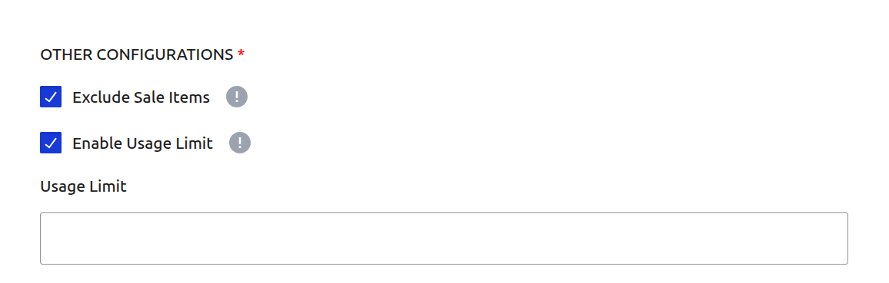

# Campaign Type: BOGO Discount (Buy X Get X)

A **BOGO (Buy One, Get One)** discount is a popular promotional tool that rewards customers with free or discounted items when they purchase a specific quantity of a product. This guide covers the **"Buy X Get X"** type, where the item the customer "gets" is the same as the item they "buy".

This is the perfect campaign type for scenarios like:

- "Buy 2 T-Shirts, Get 1 Free"
- "Buy 3, Get 1 Free" on specific items.

This guide will walk you through every field required to set up this campaign type.

## Step 1: Set Core Campaign Details

To begin, navigate to **CampaignBay → Add Campaign**. First, define the campaign's name, its core logic, and its initial state.

- **Campaign Title:** Give your campaign a clear and descriptive name. Example: `Hoodie BOGO Deal`.

- **Select Discount Type:** From the dropdown menu, choose **`Buy X Get X`**. This will reveal the specific fields for this BOGO campaign.

- **Select Status:**
  - **Active:** The campaign will be live as soon as its start time is reached.
  - **Inactive:** The campaign will be saved as a draft and will not run until you manually activate it.

## Step 2: Set the Discount Target

This crucial step defines which products in your store are eligible for the BOGO offer.

The **DISCOUNT TARGET** dropdown provides options to apply the offer to your entire store, specific products, or categories.

::: info Learn More About Targeting
The "Discount Target" setting is a powerful feature shared by all campaign types. We've created a dedicated guide to explain all of its options and conditional fields in detail.

**[Read the Full Guide: Targeting &rarr;](../core-concepts/targeting.md)**
:::

## Step 3: Define the BOGO Rule

This is the core of the "Buy X Get X" campaign. You define the quantities required for the deal.

- **Buy Amount:** Enter the number of items a customer must purchase to qualify for the offer.
- **Get Quantity:** Enter the number of items the customer will receive for free.

**Example:**
To create a "Buy 2, Get 1 Free" offer, you would set:

- **Buy Amount:** `2`
- **Get Quantity:** `1`

A customer would need to add 3 of the same item to their cart to receive the 3rd one for free.

## Step 4: Set Conditions (Optional)

This section allows you to define specific rules that must be met for the discount to apply.

1.  **Add New Condition:** Click the dropdown to select a condition type. Currently, **User Role** is available.

    

2.  **Match Type:** This setting controls how multiple conditions interact with each other.

    - **Match Any:** The discount applies if _at least one_ of the conditions is met.

      - _Example:_ If you set "User Role: Customer" OR "User Role: Subscriber", anyone with either role gets the discount.
        

    - **Match All:** The discount applies only if _all_ defined conditions are met simultaneously.
      - _Example:_ If you set "User Role: VIP" AND "Cart Total > $100", the user must match both to qualify.
        

3.  **Configure Condition:** Once a condition is added (e.g., User Role), select the specific roles or criteria.

    

::: info Future Updates
We are actively working on adding more condition types such as Cart Total and more. Stay tuned!
:::

## Step 5: Set Other Configurations (Optional)

This section provides additional rules for your campaign.

- **Exclude Sale Items:** Check this box if you do not want this campaign's discount to apply to products that are already on sale in WooCommerce. This is useful for preventing "double discounting."

- **Enable Usage Limit:** Check this box to set a maximum number of times this campaign can be used across your entire store. Once the limit is reached, the campaign will automatically become inactive.

## Step 6: Set the Schedule (Optional)

For a Scheduled Discount, setting the duration is essential. This section controls when your campaign will automatically start and end.

- **Start Time / End Time:** Use the date and time pickers to set the exact moment for the campaign to activate and expire.

::: tip Timezone Information
All dates and times are based on the timezone you have configured in your main WordPress settings under **Settings → General → Timezone**. The system automatically handles all UTC conversions for you.
:::

::: info Learn More About Automation
The status of your campaign is closely tied to the scheduling system, which uses WordPress Cron to automate activation and expiration.

**[Read the Full Guide: Scheduling & Automation &rarr;](../core-concepts/scheduling-and-automation.md)**
:::

## Step 7: Define Display Configurations

This section is unique to BOGO campaigns and controls how the offer is communicated and applied.

- **Automatically Add Free Product To Cart:** This is a powerful user experience feature.

  - **If checked:** When a customer adds the "Buy Amount" (e.g., 2 items), the free "Get Quantity" (e.g., 1 item) will be **automatically added to their cart at no cost**.
  - **If unchecked:** The customer must manually add the total quantity to their cart (e.g., 3 items). The plugin will then automatically apply a discount equal to the price of the "Get Quantity" (1 item).

- **Product Page Discount Message Format:** Enter a message to display on the product page. Use placeholders like `{buy_quantity}` and `{get_quantity}` to make it dynamic.

  - _Example:_ `Buy {buy_quantity} and get {get_quantity} free!`

- **Cart Page Discount Message Format:** Enter a message to display in the cart. Use `{title}` to show the campaign name.

  - _Example:_ `Discount '{title}' has been applied!`

- **Cart Page Message Location:** Choose where the cart message should appear (e.g., next to the line item name).

## Step 8: Save the Campaign

Once you have configured all the options, click the **Save Campaign** button. You will be redirected to the "All Campaigns" list where you can see your new BOGO offer.

## Next Steps

You have now learned about the main campaign types. It's time to explore the global settings that control your entire discount system.

- **[Configuring the Settings &rarr;](../settings.md)**
