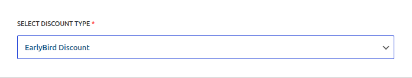
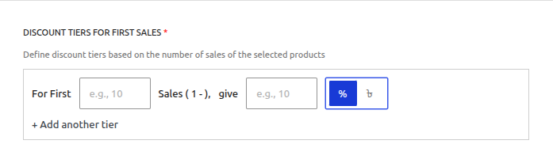

# Campaign Type: Early Bird Discount

An **Early Bird Discount** is a powerful marketing tool designed to create urgency and drive rapid sales by rewarding your first customers. The discount is based on the total number of **successful orders** that have already used the campaign.

This is the perfect campaign type for scenarios like:

- "50% off for the first 100 customers!"
- "Launch Special: The first 50 orders get $20 off, the next 100 get $10 off."
- Creating a flash sale with a limited number of available slots.

::: warning Important: Order vs. Quantity
An Early Bird discount is based on the number of **orders**, not the quantity of items purchased. If one customer buys 100 items in a single transaction, it only counts as **one** use toward the campaign's limit.
:::

This guide will walk you through every field required to set up this campaign type.

---

## Step 1: Select the Campaign Type

To begin, navigate to **Campaigns → Add Campaign**. The first field determines the core logic of your new promotion.

- **SELECT DISCOUNT TYPE:** From the dropdown menu, choose **`EarlyBird Discount`**. This will reveal the specific fields needed for a sales-based tiered campaign.

## Step 2: Set the Status

This field controls the current state of your campaign.

- **SELECT STATUS:**
  - **Active:** Choose this if you want the campaign to be live on your site (either immediately or on a future schedule).
  - **Inactive:** Choose this to save the campaign as a draft. It will not be visible or active on your store until you edit it and change the status to `Active`.
  - **Scheduled:** This status is automatically set by the system if you choose `Active` and set a future start date in the "Campaign Duration" section.

::: info Learn More About Automation
The status of your campaign is closely tied to the scheduling system, which uses WordPress Cron to automate activation and expiration.

**[Read the Full Guide: Scheduling & Automation &rarr;](../core-concepts/scheduling-and-automation.md)**
:::

## Step 3: Set the Campaign Title

Give your campaign a clear and descriptive name. This is essential for identifying it later.

- **CAMPAIGN TITLE:** Enter a name for your campaign. This title is important as it will be visible to you in the "All Campaigns" list and may also be shown to customers in the cart totals section. Example: `New Product Launch Offer`.

## Step 4: Set the Discount Target

This crucial step defines which products in your store are eligible for the early bird discount.

- **DISCOUNT TARGET:** This setting determines the scope of your discount. You can apply the discount to your entire store, specific products, categories, or tags.

::: info Learn More About Targeting
The "Discount Target" setting is a powerful feature shared by all campaign types. We've created a dedicated guide to explain all of its options and conditional fields in detail.

**[Read the Full Guide: Targeting & Conditions &rarr;](../core-concepts/targeting-and-conditions.md)**
:::

## Step 5: Define Discount Tiers For First Sales

This is the core of the Early Bird Discount. Here you will define the tiers based on the number of successful orders.

- **For First [X] Sales (Max Orders):** This is the core of the Early Bird rule. Enter the maximum number of successful orders that are eligible for this tier. For example, entering `100` means "for the first 100 sales".
- **give (Value):** The numeric value of the discount.
- **% / ৳ (Mode):** The type of discount to apply (Percentage or Fixed Currency amount).
- **+ Add another tier:** Click this to add multiple levels of Early Bird offers.

### How Tiers Work

The tiers work sequentially. The system checks them in order based on their "Max Orders" value.

**Example Tier Setup:**

- **Tier 1:** For First `100` Sales, give `50` `%`
- **Tier 2:** For First `250` Sales, give `25` `%`

**In this scenario:**

- Orders 1 through 100 will receive a 50% discount.
- Orders 101 through 250 will receive a 25% discount.
- Order 251 and beyond will receive no discount.

## Step 6: Set the Campaign Duration (Optional)

An Early Bird discount can be run immediately or, more powerfully, **scheduled** for a future date.

- **To run the campaign immediately:** Leave the "Enable Scheduling" toggle OFF. The usage counter will begin tracking sales as soon as you save the campaign.
- **To run the campaign for a specific period:** Turn the "Enable Scheduling" toggle ON and set your desired **Start Date**, **End Date**, and times.

::: tip Use Case for Scheduling
Scheduling an Early Bird offer is perfect for a product launch or a Black Friday promotion. You can build hype for days or weeks, and the usage counter will **only begin tracking sales after the scheduled start time**.
:::

## Step 7: Save the Campaign

Once you have configured all the options, click the **Save Campaign** button at the top right of the page. After saving, you will be redirected back to the "All Campaigns" list.

## Next Steps

You've now learned about all the campaign types. It's time to understand the global settings that control your entire discount system.

- **[Configuring the Settings &rarr;](../settings.md)**
