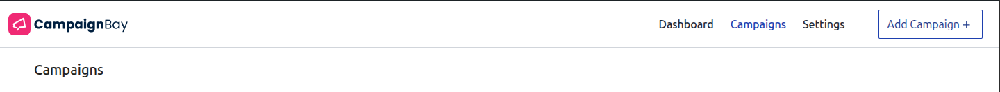
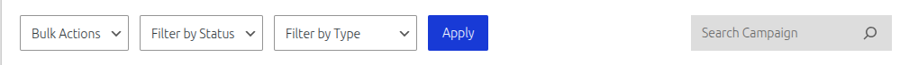
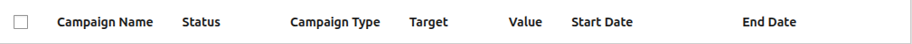
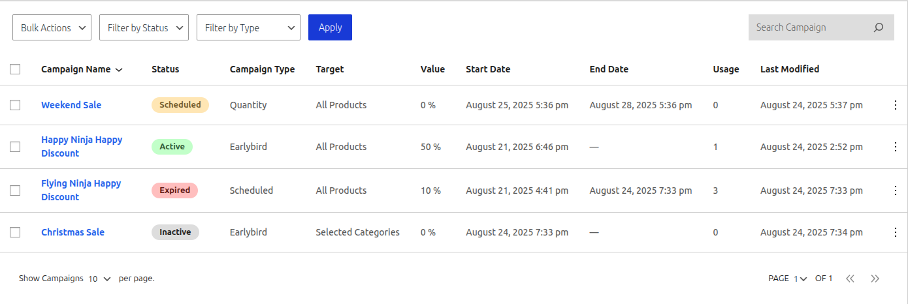
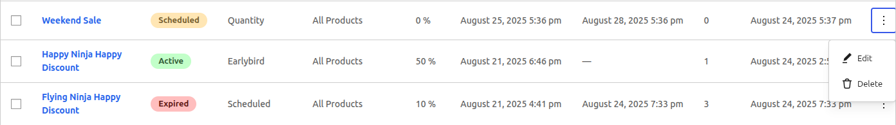
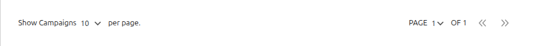

# All Campaigns

The "All Campaigns" page is your central hub for managing and organizing all the discount campaigns you create. From this screen, you can view, filter, sort, and perform actions on your campaigns.

### Page Header

The header provides the page title and the primary action for creating a new campaign.

- **Campaigns Title:** The main title of the page.
- **Add Campaign +:** This button will take you to the "Add Campaign" screen, where you can create a new discount from scratch.

---

## Filtering and Searching

A powerful set of tools is available to help you find specific campaigns quickly, especially if you have a large number.

1.  **Bulk Actions:** This dropdown is used to perform actions on multiple campaigns at once. To use it, first select the campaigns you want to modify using the checkboxes in the first column of the table. The available actions are:

    - **Activate:** Changes the status of the selected campaigns to `Active`.
    - **Deactivate:** Changes the status of the selected campaigns to `Inactive`.
    - **Delete:** Permanently deletes the selected campaigns. A confirmation will be required.

2.  **Filter by Status:** This dropdown allows you to view campaigns that match a specific status (e.g., show only `Active` or `Scheduled` campaigns).

3.  **Filter by Type:** This dropdown allows you to view campaigns of a specific type (e.g., show only `Quantity` or `Earlybird` discounts).

4.  **Apply:** After selecting your desired bulk action or filters, click this button to apply them.

5.  **Search Campaign:** Use this field to find a campaign by its name. The table will update as you type to show matching results.

---

## The Campaigns Table

The main table provides a detailed overview of all your campaigns.

### Table Columns

- **Checkbox:** Used to select one or more campaigns for bulk actions. Click the checkbox in the header to select all campaigns on the current page.
- **Campaign Name:** The title you gave your campaign. Clicking the name will take you to the edit screen for that campaign.
- **Status:** The current status of the campaign. See the different statuses below.
- **Campaign Type:** The core logic of the campaign (e.g., `Scheduled`, `Quantity`, `Earlybird`).
- **Target:** The scope of the campaign (e.g., `Entire Store`, `Selected Categories`).
- **Value:** The primary discount value (e.g., `50%` or `$10`). For tiered discounts, this typically shows the value for the first tier.
- **Start Date / End Date:** The scheduled start and end times for the campaign. An em-dash (`—`) indicates that no date is set.
- **Usage:** The number of times a campaign has been successfully applied to a completed order.
- **Last Modified:** The date and time the campaign was last saved.
- **Action:** Provides a menu of actions for the specific campaign in that row.

### Understanding the Data

The table provides an at-a-glance view of your campaigns, including their different statuses.

- **Scheduled:** The campaign is set to start at a future date.
- **Active:** The campaign is currently running and applying discounts.
- **Expired:** The campaign's end date has passed.
- **Inactive:** The campaign is saved as a draft and is not active.

### Row Actions

To manage an individual campaign, click the three-dot icon in the "Action" column.

- **Edit:** Opens the "Edit Campaign" screen for this specific campaign.
- **Delete:** Permanently deletes this campaign after a confirmation.

---

## Table Footer & Pagination

The footer provides tools for managing the view when you have a large number of campaigns.

- **Show Campaigns per page:** This dropdown allows you to control how many campaigns are displayed on a single page.
- **Pagination:** Use the page selector and arrow buttons to navigate between different pages of your campaign list.

## Next Steps

Now that you know how to manage your campaigns, let's dive into the specifics of each campaign type.

- **[Learn about Scheduled Discounts &rarr;](./scheduled-discounts.md)**
