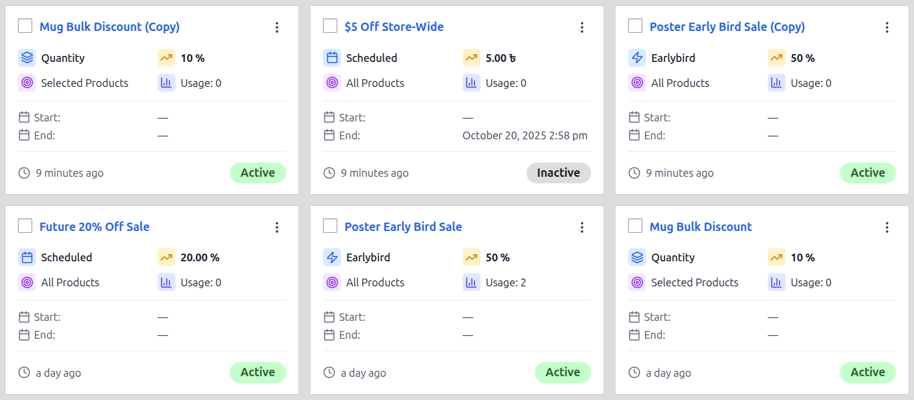
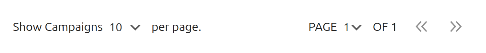

# All Campaigns

The "All Campaigns" page is your central hub for managing and organizing all the discount campaigns you create. From this screen, you can view, filter, sort, and perform actions on your campaigns using either a detailed Table View or a more visual Grid View.

### Page Header

The header provides the page title and primary actions for creating and managing campaigns.

- **Campaigns Title:** The main title of the page.
- **Import / Export:** These buttons open a modal window for bulk importing and exporting campaigns.
- **Add Campaign +:** This button will take you to the "Add Campaign" screen, where you can create a new discount from scratch.

## Filtering and Searching

A powerful set of tools is available to help you find specific campaigns quickly.

1.  **Bulk Actions:** This dropdown allows you to perform an action on multiple campaigns at once.

    - **How to use:** First, select the campaigns you want to modify using the checkboxes. Then, choose an action (`Activate`, `Deactivate`, or `Delete`) from this dropdown. Finally, click the **Apply** button to execute the action. A confirmation will be required for destructive actions like deleting.

2.  **Filter by Status & Filter by Type:** Use these dropdowns to narrow down the list of visible campaigns. You can filter by status (`Active`, `Inactive`, etc.) or by campaign type (`Scheduled`, `Quantity`, etc.). After making your selections, click the **Apply** button to see the filtered results.

3.  **View Toggle:** Switch between the detailed **Table View** and the visual **Grid View**. This setting is automatically saved for your next visit.

4.  **Search Campaign:** This is an instant search field. Simply start typing a campaign's name, and the list will update in real-time to show you matching results.

## Table View

The Table View provides a dense, data-rich overview of all your campaigns, with sortable columns for easy organization.

### Table Columns

- **Checkbox:** Used to select campaigns for bulk actions.
- **Campaign Name:** The title of your campaign. Clicking the name will take you to the edit screen.
- **Status:** The current status of the campaign (e.g., `Active`, `Inactive`).
- **Campaign Type:** The core logic of the campaign (e.g., `Scheduled`, `Quantity`).
- **Target:** The scope of the campaign (e.g., `Entire Store`, `Selected Products`).
- **Value:** The primary discount value.
- **Start Date / End Date:** The scheduled start and end times. An em-dash (`—`) indicates no date is set.
- **Usage:** The number of times a campaign has been successfully applied to a completed order.
- **Last Modified:** How long ago the campaign was last saved.

### Row Actions

To manage an individual campaign, click the three-dot icon at the end of the row.

- **Edit:** Opens the "Edit Campaign" screen.
- **Duplicate:** Creates an exact copy of the campaign and opens it for editing.
- **Delete:** Permanently deletes the campaign after a confirmation.

## Grid View

The Grid View offers a more visual, card-based layout for your campaigns, providing key information at a glance.

Each card in the grid displays the most important details about a campaign:

- **Checkbox and Action Menu:** For bulk actions and individual actions.
- **Campaign Name:** The title of the campaign.
- **Status:** The current status shown as a colored pill.
- **Key Details:** Icons display the Campaign Type, Target, Value, and Usage count.
- **Schedule:** Start and End dates are clearly listed.
- **Last Modified:** Shows how long ago the campaign was updated.

## Page Footer & Pagination

The footer provides tools for managing the view when you have a large number of campaigns.

- **Show Campaigns per page:** Control how many campaigns are displayed on a single page.
- **Pagination:** Use the page selector and arrow buttons to navigate between pages of your campaign list.

## Next Steps

Now that you know how to manage your campaigns, let's dive into the specifics of each campaign type.

- **[Learn about Scheduled Discounts &rarr;](./scheduled-discounts.md)**
