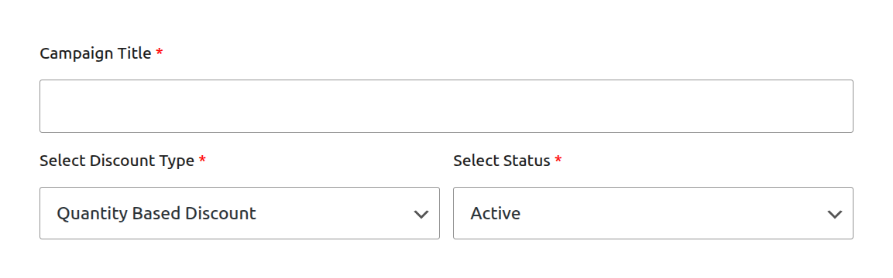
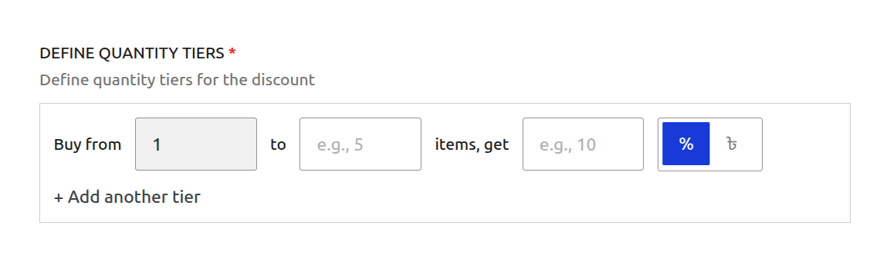
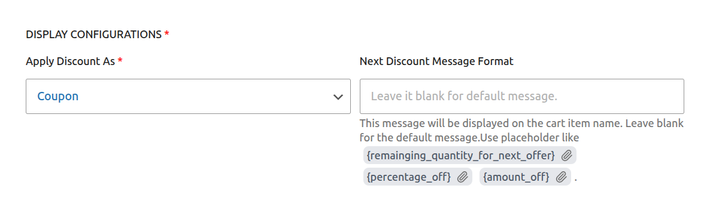

# Campaign Type: Quantity Based Discount

A **Quantity Based Discount** is a powerful tool for creating tiered pricing structures that reward customers for buying in bulk. This encourages larger order values by reducing the per-item cost as the quantity increases.

This is the perfect campaign type for scenarios like:

- "Buy 3 or more, get 10% off each"
- "Buy a case of 12 and get $2 off each bottle"
- Creating wholesale-style pricing for regular customers.

This guide will walk you through every field required to set up this campaign type.

## Step 1: Set Core Campaign Details

To begin, navigate to **CampaignBay → Add Campaign**. First, define the campaign's name, its core logic, and its initial state.

- **Campaign Title:** Give your campaign a clear and descriptive name. This is essential for identifying it later. Example: `T-Shirt Bulk Discount`.

- **Select Discount Type:** From the dropdown menu, choose **`Quantity Based Discount`**. This will reveal the specific fields needed for a tiered pricing campaign.

- **Select Status:**
  - **Active:** The campaign will be live as soon as its start time is reached.
  - **Inactive:** The campaign will be saved as a draft and will not run until you manually activate it later.

## Step 2: Set the Discount Target

This crucial step defines which products in your store are eligible for the quantity discount.

The **DISCOUNT TARGET** dropdown provides powerful options to control the scope of your campaign, such as applying it to the entire store, specific products, or categories.

::: info Learn More About Targeting
The "Discount Target" setting is a powerful feature shared by all campaign types. We've created a dedicated guide to explain all of its options and conditional fields in detail.

**[Read the Full Guide: Targeting &rarr;](../core-concepts/targeting.md)**
:::

## Step 3: Define Quantity Tiers

This is the core of the Quantity Based Discount. Here you will define the specific pricing levels for your promotion.

You can create one or more tiers. Each tier has the following fields:

- **Buy from:** The minimum quantity of an item a customer must have in their cart to qualify for this tier's discount.
- **to:** The maximum quantity for this tier. **Leave this blank** for the final tier to mean "and up" (e.g., 11 or more).
- **items, get:** The numeric value of the discount.
- **% / $ (Mode):** The type of discount to apply.
  - **Percentage (%):** A percentage discount calculated on the price of each item.
  - **Currency ($):** A fixed amount deducted from the price of **each individual item**.

::: warning Fixed Amount Logic
When using a fixed discount (e.g., `$5`), the discount is applied **per item**. If a customer buys 4 items that qualify, they will receive a $5 discount on all 4 items.
:::

- **+ Add another tier:** Click this to add more pricing levels to your campaign.

### Example Tier Setup

Here is an example of a multi-level discount for a product:

- **Tier 1:** Buy from `3` to `5` items, get `10` `%`
- **Tier 2:** Buy from `6` to `10` items, get `15` `%`
- **Tier 3:** Buy from `11` to ``items, get`20` `%`

## Step 4: Set Conditions (Optional)

This section allows you to define specific rules that must be met for the discount to apply.

1.  **Add New Condition:** Click the dropdown to select a condition type. Currently, **User Role** is available.

    

2.  **Match Type:** This setting controls how multiple conditions interact with each other.

    - **Match Any:** The discount applies if _at least one_ of the conditions is met.

      - _Example:_ If you set "User Role: Customer" OR "User Role: Subscriber", anyone with either role gets the discount.
        

    - **Match All:** The discount applies only if _all_ defined conditions are met simultaneously.
      - _Example:_ If you set "User Role: VIP" AND "Cart Total > $100", the user must match both to qualify.
        

3.  **Example: Restrict to VIP Users:**
    In this example, we want to make this campaign exclusive to our "VIP" members.

    - Select **User Role** from the condition dropdown.
    - Choose **VIP** from the list of roles.
    - Now, this discount will **only** apply to logged-in users with the **VIP** role. Everyone else (including guests) will see the regular price.

    

::: info Future Updates
We are actively working on adding more condition types such as Cart Total and more. Stay tuned!
:::

## Step 5: Set Other Configurations (Optional)

This section provides additional rules for your campaign.

- **Exclude Sale Items:** Check this box if you do not want this campaign's discount to apply to products that are already on sale in WooCommerce. This is useful for preventing "double discounting."

- **Enable Usage Limit:** Check this box to set a maximum number of times this campaign can be used across your entire store. Once the limit is reached, the campaign will automatically become inactive.

## Step 6: Set the Schedule (Optional)

For a Scheduled Discount, setting the duration is essential. This section controls when your campaign will automatically start and end.

- **Start Time / End Time:** Use the date and time pickers to set the exact moment for the campaign to activate and expire.

::: tip Timezone Information
All dates and times are based on the timezone you have configured in your main WordPress settings under **Settings → General → Timezone**. The system automatically handles all UTC conversions for you.
:::

::: info Learn More About Automation
The status of your campaign is closely tied to the scheduling system, which uses WordPress Cron to automate activation and expiration.

**[Read the Full Guide: Scheduling & Automation &rarr;](../core-concepts/scheduling-and-automation.md)**
:::

## Step 7: Define Display Configurations (Optional)

This section allows you to customize how the discount is applied and communicated to the customer in the cart.

- **Apply Discount As:** This setting determines how the final cart discount is presented to the customer.

  - **Coupon:** Creates a virtual coupon in the cart with a descriptive title.
  - **Discount:** Applies the discount directly as a line item in the cart totals, labeled as "Discount".
  - **Strike through in line total:** This option does not apply a coupon or a separate discount line. Instead, it changes the subtotal for the product in the cart, showing the original subtotal crossed out and the new, lower price. This is a very direct way to show the savings.

- **Next Discount Message Format:** Enter a custom message to be displayed on the cart item if the customer is close to unlocking the next discount tier. You can use placeholders like `{remaining_quantity_for_next_offer}` which will be automatically replaced with the number of items needed.

## Step 8: Save the Campaign

Once you have configured all the options, click the **Save Campaign** button at the top right of the page. After saving, you will be redirected back to the "All Campaigns" list.

## Next Steps

Next, learn how to create campaigns that create urgency by rewarding your first customers.

- **[Creating an Early Bird Discount &rarr;](./early-bird-discounts.md)**
