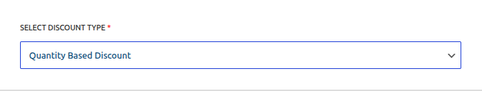
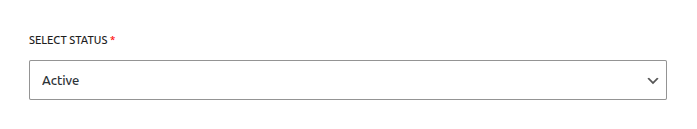
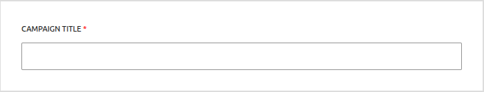
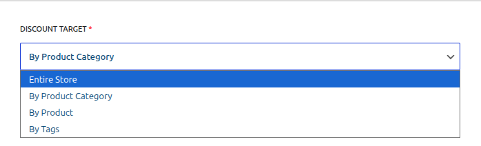
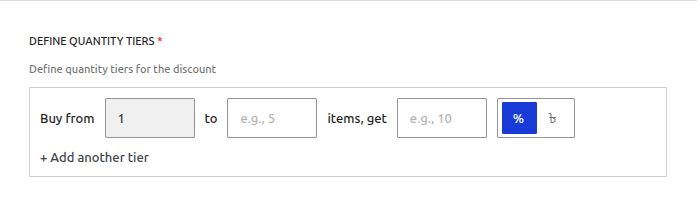
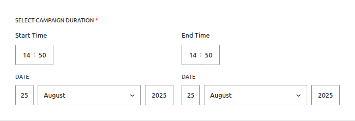

# Campaign Type: Quantity Based Discount

A **Quantity Based Discount** is a powerful tool for creating tiered pricing structures that reward customers for buying in bulk. This encourages larger order values by reducing the per-item cost as the quantity of that item in the cart increases.

This is the perfect campaign type for scenarios like:

- "Buy 3 or more, get 10% off each"
- "Buy a case of 12 and get $2 off each bottle"
- Creating wholesale-style pricing for regular customers.

This guide will walk you through every field required to set up this campaign type.

---

## Step 1: Select the Campaign Type

To begin, navigate to **Campaigns → Add Campaign**. The first field determines the core logic of your new promotion.

- **SELECT DISCOUNT TYPE:** From the dropdown menu, choose **`Quantity Based Discount`**. This will reveal the specific fields needed for a tiered pricing campaign.

## Step 2: Set the Status

This field controls the current state of your campaign.

- **SELECT STATUS:**
  - **Active:** Choose this if you want the campaign to be live on your site (either immediately or on a future schedule).
  - **Inactive:** Choose this to save the campaign as a draft. It will not be visible or active on your store until you edit it and change the status to `Active`.
  - **Scheduled:** You should not select this manually. The system will automatically set the campaign to `Scheduled` if you choose `Active` and set a future start date in the "Campaign Duration" section.

::: info Learn More About Automation
The status of your campaign is closely tied to the scheduling system, which uses WordPress Cron to automate activation and expiration.

**[Read the Full Guide: Scheduling & Automation &rarr;](../core-concepts/scheduling-and-automation.md)**
:::

## Step 3: Set the Campaign Title

Give your campaign a clear and descriptive name. This is essential for identifying it later.

- **CAMPAIGN TITLE:** Enter a name for your campaign. This title will be visible to you in the "All Campaigns" list and may also be shown to customers in the cart totals section. Example: `T-Shirt Bulk Discount`.

## Step 4: Set the Discount Target

This crucial step defines which products in your store are eligible for the quantity discount.

- **DISCOUNT TARGET:** This setting determines the scope of your discount. You can apply the discount to your entire store, specific products, categories, or tags.

::: info Learn More About Targeting
The "Discount Target" setting is a powerful feature shared by all campaign types. We've created a dedicated guide to explain all of its options and conditional fields in detail.

**[Read the Full Guide: Targeting & Conditions &rarr;](../core-concepts/targeting-and-conditions.md)**
:::

## Step 5: Define Quantity Tiers

This is the core of the Quantity Based Discount. Here you will define the specific pricing levels for your promotion.

You can create one or more tiers. Each tier has the following fields:

- **Buy from (Min):** The minimum quantity of the item a customer must have in their cart to qualify for this tier's discount.
- **to (Max):** The maximum quantity for this tier. **Leave this blank** for the final tier to mean "and up" (e.g., 11 or more).
- **items, get (Value):** The numeric value of the discount.
- **% / ৳ (Mode):** The type of discount to apply.
  - **Percentage (%):** A percentage discount calculated on the price of each item.
  - **Currency (৳):** A fixed amount deducted from the price of **each individual item**.

::: warning Fixed Amount Logic
When using a fixed discount (e.g., `5৳`), the discount is applied **per item**. If a customer buys 4 items that qualify, they will receive a 5৳ discount on all 4 items.
:::

- **+ Add another tier:** Click this to add more pricing levels to your campaign.

### Example Tier Setup

Here is an example of a multi-level discount for a product:

- **Tier 1:** Buy from `3` to `5` items, get `10` `%`
- **Tier 2:** Buy from `6` to `10` items, get `15` `%`
- **Tier 3:** Buy from `11` to ``items, get`20` `%`

## Step 6: Set the Campaign Duration (Optional)

A Quantity Discount can be run immediately or scheduled for a specific time period. This is a critical and powerful feature.

- **To run the campaign immediately and indefinitely:** Leave the "Enable Scheduling" toggle OFF. The campaign will become active as soon as you save it (if its status is `Active`).
- **To run the campaign for a specific period:** Turn the "Enable Scheduling" toggle ON and set your desired **Start Date**, **End Date**, and times. This is perfect for promotions like a "Weekend Bulk Special" or a month-long "Stock Up & Save" event.

::: tip Timezone Information
All dates and times are based on the timezone you have configured in your main WordPress settings under **Settings → General → Timezone**.

**[Read the Full Guide: Scheduling & Automation &rarr;](../core-concepts/scheduling-and-automation.md)**
:::

## Step 7: Save the Campaign

Once you have configured all the options, click the **Save Campaign** button at the top right of the page. After saving, you will be redirected back to the "All Campaigns" list.

## Next Steps

Next, learn how to create campaigns that create urgency by rewarding your first customers.

- **[Creating an Early Bird Discount &rarr;](./early-bird-discounts.md)**
