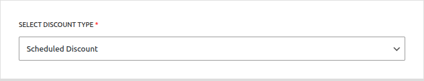
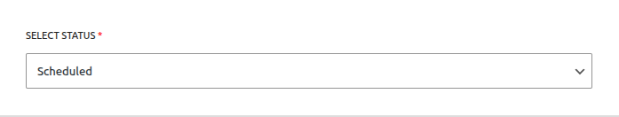

# Campaign Type: Scheduled Discount

A **Scheduled Discount** is the most common and straightforward type of campaign. It allows you to apply a direct price reduction (either a fixed amount or a percentage) to products for a specific, pre-defined period.

This is the perfect tool for running classic sales events like:

- Weekend Flash Sales
- Holiday Promotions (e.g., Black Friday, New Year's)
- Seasonal or End-of-Season Clearance Sales

This guide will walk you through creating a Scheduled Discount step by step.

## Step 1: Select Campaign Type and Status

To begin, navigate to **Campaigns → Add Campaign**. The first step is to define the campaign's core logic and its initial state.

- **SELECT DISCOUNT TYPE:** For this guide, choose **`Scheduled Discount`** from the dropdown menu. This configures the campaign to apply a simple, direct price reduction.

- **SELECT STATUS:** This determines the state of your campaign upon saving.
  - **Active:** The campaign will be live as soon as its start time is reached (or immediately if no future start time is set).
  - **Inactive:** The campaign will be saved as a draft and will not run until you manually activate it later.
  - **Scheduled:** This status is automatically set by the system if you choose "Active" and set a start date that is in the future.

::: tip
For scheduled campaigns, it's best to set the Status to **Active**. The system will intelligently set it to **Scheduled** if your start date is in the future.
:::

## Step 2: Set the Campaign Title

Next, give your campaign a clear and descriptive name. This is essential for identifying it later.

- **CAMPAIGN TITLE:** Enter a name for your campaign. This title is important as it will be visible to you in the "All Campaigns" list and may also be shown to customers in the cart totals section. Example: `Summer Weekend Sale`.

## Step 3: Set the Discount Target

This crucial step defines which products in your store are eligible for the discount.

The **DISCOUNT TARGET** dropdown provides powerful options to control the scope of your campaign, such as applying it to the entire store, specific products, or categories.

::: info Learn More About Targeting
The "Discount Target" setting is a powerful feature shared by all campaign types. We've created a dedicated guide to explain all of its options and conditional fields in detail.

**[Read the Full Guide: Targeting & Conditions &rarr;](../core-concepts/targeting-and-conditions.md)**
:::

## Step 4: Define the Discount Value

This is where you set the actual discount amount the customer will receive.

1.  **Choose the Mode:** Use the toggle button to select between:

    - **Percentage %:** The discount will be a percentage of the product's price (e.g., `20%`).
    - **Currency ৳:** The discount will be a fixed amount deducted from the product's price (e.g., `5.00৳`).

2.  **Enter Value:** In the input field below, enter the numeric value for your discount (e.g., `20` for a 20% discount).

## Step 5: Set the Campaign Duration

For a Scheduled Discount, setting the duration is essential. This section controls when your campaign will automatically start and end.

- **Start Time / End Time:** Set the exact time of day for the campaign to activate and expire.
- **Date:** Select the day, month, and year for the start and end dates.

::: tip Timezone Information
All dates and times are based on the timezone you have configured in your main WordPress settings under **Settings → General → Timezone**. The system automatically handles all UTC conversions for you.
:::

::: info Learn More About Automation
The status of your campaign is closely tied to the scheduling system, which uses WordPress Cron to automate activation and expiration.

**[Read the Full Guide: Scheduling & Automation &rarr;](../core-concepts/scheduling-and-automation.md)**
:::

## Step 6: Save the Campaign

Once you have configured all the options, click the **Save Campaign** button at the top right or the **Save Changes** button at the bottom of the page. After saving, you will be redirected back to the "All Campaigns" list, where you can see your new campaign.

## Next Steps

Now that you've mastered the Scheduled Discount, learn how to create campaigns that reward customers for buying in bulk.

- **[Creating a Quantity Based Discount &rarr;](./quantity-discounts.md)**
