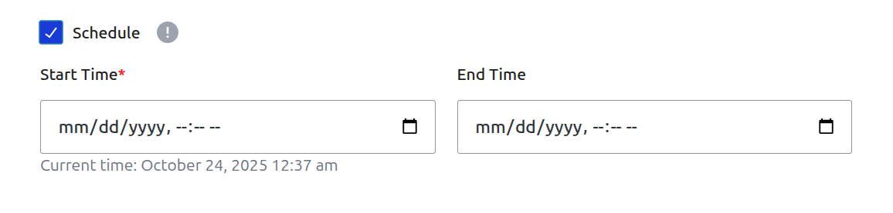
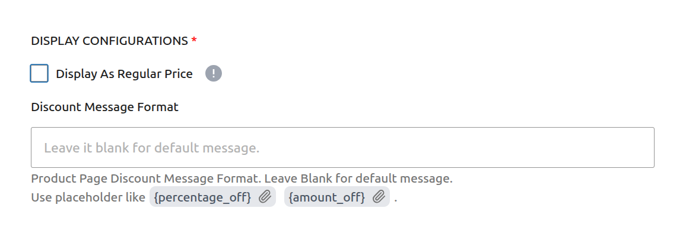

# Campaign Type: Scheduled Discount

A **Scheduled Discount** is the most common and straightforward type of campaign. It allows you to apply a direct price reduction (either a fixed amount or a percentage) to products for a specific, pre-defined period.

This is the perfect tool for running classic sales events like:

- Weekend Flash Sales
- Holiday Promotions (e.g., Black Friday, New Year's)
- Seasonal or End-of-Season Clearance Sales

This guide will walk you through creating a Scheduled Discount step by step.

## Step 1: Set Core Campaign Details

To begin, navigate to **CampaignBay → Add Campaign**. The first step is to define the campaign's name, its core logic, and its initial state.

- **Campaign Title:** Give your campaign a clear and descriptive name. This is essential for identifying it later in the "All Campaigns" list. Example: `Summer Weekend Sale`.

- **Select Discount Type:** For this guide, choose **`Scheduled Discount`** from the dropdown menu. This configures the campaign to apply a simple, direct price reduction.

- **Select Status:** This determines the state of your campaign upon saving.
  - **Active:** The campaign will be live as soon as its start time is reached (or immediately if no future start time is set).
  - **Inactive:** The campaign will be saved as a draft and will not run until you manually activate it later.

::: tip
For scheduled campaigns, it's best to set the Status to **Active**. The system will intelligently change the status to **Scheduled** if you set a start date that is in the future.
:::

## Step 2: Set the Discount Target

This crucial step defines which products in your store are eligible for the discount.

The **DISCOUNT TARGET** dropdown provides powerful options to control the scope of your campaign, such as applying it to the entire store, specific products, or categories.

::: info Learn More About Targeting
The "Discount Target" setting is a powerful feature shared by all campaign types. We've created a dedicated guide to explain all of its options and conditional fields in detail.

**[Read the Full Guide: Targeting &rarr;](../core-concepts/targeting.md)**
:::

## Step 3: Define the Discount Value

This is where you set the actual discount amount the customer will receive.

1.  **Choose the Mode:** Use the toggle button to select between:

    - **Percentage %:** The discount will be a percentage of the product's price (e.g., `20%`).
    - **Currency \$:** The discount will be a fixed amount deducted from the product's price (e.g., `$5.00`).

2.  **Enter Value:** In the input field, enter the numeric value for your discount (e.g., `20` for a 20% discount).

## Step 4: Set Conditions (Optional)

This section allows you to define specific rules that must be met for the discount to apply.

1.  **Add New Condition:** Click the dropdown to select a condition type. Currently, **User Role** is available.

    

2.  **Match Type:** This setting controls how multiple conditions interact with each other.

    - **Match Any:** The discount applies if _at least one_ of the conditions is met.

      - _Example:_ If you set "User Role: Customer" OR "User Role: Subscriber", anyone with either role gets the discount.
        

    - **Match All:** The discount applies only if _all_ defined conditions are met simultaneously.
      - _Example:_ If you set "User Role: VIP" AND "Cart Total > $100", the user must match both to qualify.
        

3.  **Example: Restrict to VIP Users:**
    In this example, we want to make this campaign exclusive to our "VIP" members.

    - Select **User Role** from the condition dropdown.
    - Choose **VIP** from the list of roles.
    - Now, this discount will **only** apply to logged-in users with the **VIP** role. Everyone else (including guests) will see the regular price.

    

::: info Future Updates
We are actively working on adding more condition types such as Cart Total and more. Stay tuned!
:::

## Step 5: Set Other Configurations (Optional)

This section provides additional rules for your campaign.

- **Exclude Sale Items:** Check this box if you do not want this campaign's discount to apply to products that are already on sale in WooCommerce. This is useful for preventing "double discounting."

- **Enable Usage Limit:** Check this box to set a maximum number of times this campaign can be used across your entire store. Once the limit is reached, the campaign will automatically become inactive.

## Step 6: Set the Schedule (Optional)

For a Scheduled Discount, setting the duration is essential. This section controls when your campaign will automatically start and end.

- **Start Time / End Time:** Use the date and time pickers to set the exact moment for the campaign to activate and expire.

::: tip Timezone Information
All dates and times are based on the timezone you have configured in your main WordPress settings under **Settings → General → Timezone**. The system automatically handles all UTC conversions for you.
:::

::: info Learn More About Automation
The status of your campaign is closely tied to the scheduling system, which uses WordPress Cron to automate activation and expiration.

**[Read the Full Guide: Scheduling & Automation &rarr;](../core-concepts/scheduling-and-automation.md)**
:::

## Step 7: Define Display Configurations

This optional section allows you to customize how the discount is communicated to the customer on the product page.

- **Display As Regular Price:** This setting is for display purposes only and is less common for scheduled sales. It changes the visual price on the product page.

- **Discount Message Format:** Enter a custom message to be displayed on the product page when this discount is active. You can use placeholders like `{percentage_off}` and `{amount_off}` which will be automatically replaced with the discount values.

## Step 8: Save the Campaign

Once you have configured all the options, click the **Save Campaign** button at the top right or the **Save Changes** button at the bottom of the page. After saving, you will be redirected back to the "All Campaigns" list, where you can see your new campaign.

## Next Steps

Now that you've mastered the Scheduled Discount, learn how to create campaigns that reward customers for buying in bulk.

- **[Creating a Quantity Based Discount &rarr;](./quantity-discounts.md)**
