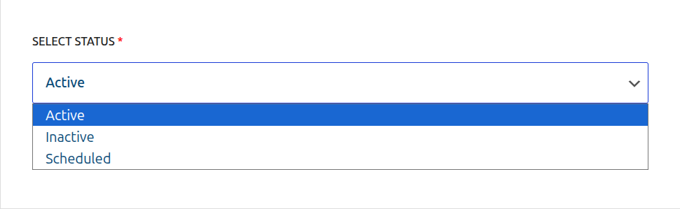
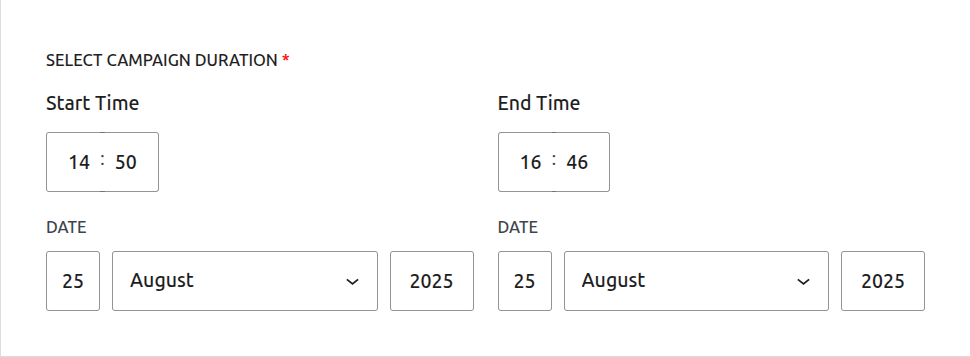

# Core Concepts: Scheduling & Automation

One of the most powerful features of CampaignBay is its ability to automatically start and stop your campaigns based on a schedule you define. This allows you to "set and forget" your promotions, ensuring they run exactly when you intend, even if you're not online.

This guide explains how this powerful automation works.

## How Scheduling Works: Statuses and Time

The automation is based on the interaction between two key settings on the "Add/Edit Campaign" page: the **Status** you select and the **Campaign Duration** you define.

### The Status Field

The status you choose determines how the scheduling system will treat your campaign.

- **`Active`**: A campaign set to `Active` is intended to be live **right now**. It will start applying discounts immediately, provided its start date (if any) is in the past and its end date has not yet been reached.

- **`Inactive`**: This is a **manual draft** status. A campaign set to `Inactive` is saved but will **never** run, regardless of its start or end dates. It is completely ignored by the discount engine until you manually change its status back to `Active` or `Scheduled`.

- **`Scheduled`**: This status tells the system that the campaign is **waiting to run in the future**. The plugin will monitor the "Start Time" and will automatically change the status to `Active` when that time is reached.

- **`Expired`**: This is an **automatic** status set by the system. You cannot select it manually. When an `Active` or `Scheduled` campaign's "End Time" is reached, the system will automatically change its status to `Expired`, and it will stop applying discounts.

### The Duration Fields

These fields are where you set the precise start and end times for your promotion.

- **Start Time / End Date:** These dates and times are the triggers for the automation system.

### The Automation Logic in Practice

Here is exactly how the system evaluates your campaigns:

1.  **To activate a campaign:** The system looks for campaigns with the status **`Scheduled`**. When the current time passes the campaign's **Start Time**, its status is automatically changed to **`Active`**.
2.  **To deactivate a campaign:** The system looks for campaigns with the status **`Active`** or **`Scheduled`**. When the current time passes the campaign's **End Time**, its status is automatically changed to **`Expired`**.

::: tip
For a campaign that you want to start in the future, you must set its status to **`Scheduled`** in the dropdown.
:::

::: info Timezone Information
All dates and times are based on the timezone you have configured in your main WordPress settings under **Settings → General → Timezone**. The system automatically handles all UTC conversions for you.
:::

## The Automation Engine: Built for Reliability

CampaignBay uses a robust, two-part system to ensure your campaigns always run on time.

### 1. WordPress Cron Events

When you save a campaign with a future start or end date, CampaignBay schedules a task (a "cron job") with WordPress. The built-in WordPress Cron system is designed to trigger these tasks at the precise moment they are due, automatically changing your campaign's status.

### 2. The CampaignBay Failsafe (Guaranteed Accuracy)

We understand that some hosting environments or low-traffic sites can have an unreliable WordPress Cron system. To solve this, CampaignBay includes a powerful **failsafe mechanism**.

**You do not need to do anything to enable it—it's always working for you in the background.**

On a regular basis, our failsafe system manually checks all `Active` and `Scheduled` campaigns. If it finds any campaign where a scheduled time was missed (for example, due to a period of no site traffic), it will **immediately correct the status**.

::: tip Peace of Mind
This built-in failsafe guarantees that your campaign statuses will always be accurate, even if the underlying WordPress Cron system is disabled or experiences a delay. You can schedule your most important sales with confidence.
:::

## Next Steps

Now that you understand how scheduling works, let's explore the final core concept of the plugin.

- **[Learn about the Discount Engine &rarr;](./understanding-the-engine.md)**
