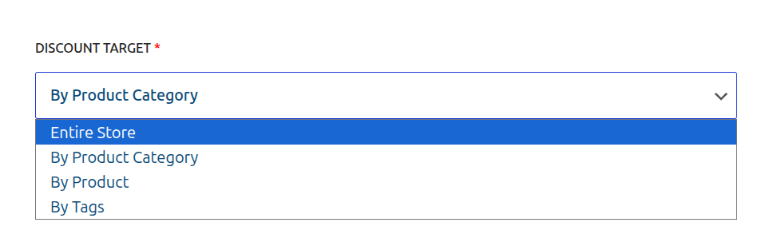
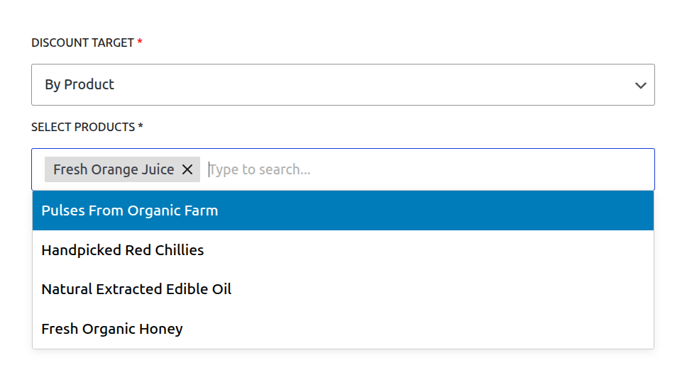
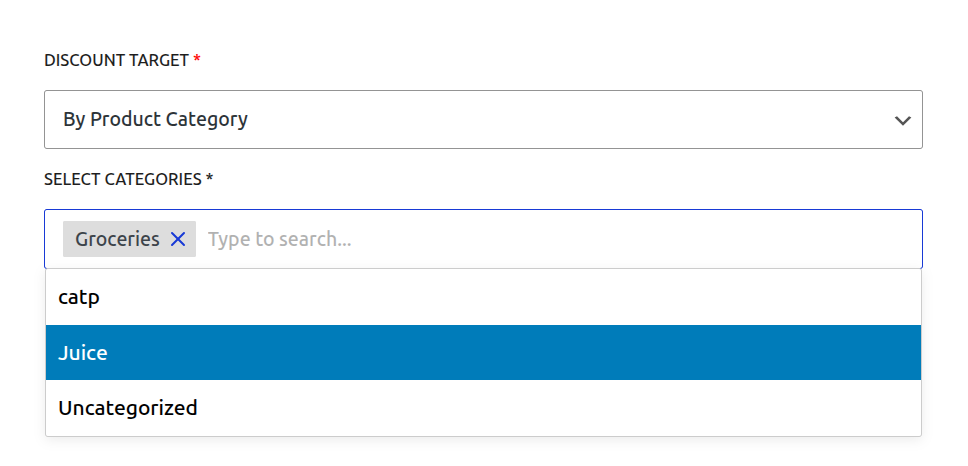

# Core Concepts: Targeting & Conditions

One of the most powerful features of CampaignBay is the ability to precisely control which products are eligible for a discount. The **Discount Target** setting, which appears on the "Add/Edit Campaign" screen, is the primary tool for defining this scope.

This guide provides a detailed explanation of each available targeting option.

## Targeting Options Overview

When you create or edit any campaign, you will see the "DISCOUNT TARGET" dropdown menu. This is where you select the core logic for how the plugin will find eligible products.

There are three primary methods for targeting your discounts:

1.  Entire Store
2.  By Product
3.  By Product Category

Let's explore each option in detail.

### 1. Entire Store

- **What it does:** This is the broadest and simplest option. When selected, the campaign's discount will be applied to **every single product** in your WooCommerce store (unless excluded by other campaign rules like "Exclude Sale Items").
- **Best for:** Store-wide sales events like Black Friday, Cyber Monday, anniversary sales, or any promotion where you want to offer a discount on everything.
- **Configuration:** No further configuration is needed. Simply select this option.

### 2. By Product

- **What it does:** This is the most specific targeting option. It allows you to hand-pick individual products that will be included in (or excluded from) the discount.
- **Best for:** Promoting a new product, running a "Deal of the Week" on a specific item, or clearing out the remaining stock of a few specific products.
- **Configuration:** When selected, a **"Select Products"** field will appear.

- **Select Products:** Click inside the box and start typing the name of a product to search. Select one or more products from the list. If you select a **variable product**, the rule will apply to all of its variations.
- **Exclude Items:** This powerful checkbox inverts the logic.
  - **Unchecked (Default):** The discount will apply **only** to the products you selected.
  - **Checked:** The discount will apply to **all products in your store EXCEPT** for the ones you selected.

### 3. By Product Category

- **What it does:** This option allows you to apply a discount to all products that belong to one or more specific categories.
- **Best for:** Targeted promotions, such as "15% off all T-Shirts" or a clearance sale on your "Electronics" and "Accessories" categories.
- **Configuration:** When you select this option, a **"Select Categories"** field will appear.

- **Select Categories:** Click inside the box and start typing the name of a category to search. Select one or more categories from the list. The discount will apply to all products within the selected categories (including their sub-categories).
- **Exclude Items:** This checkbox inverts the logic.
  - **Unchecked (Default):** The discount will apply **only** to products within the categories you selected.
  - **Checked:** The discount will apply to **all products in your store EXCEPT** for those in the categories you selected.

## Next Steps

Now that you understand how to target your campaigns, let's explore the final core concept that powers the plugin.

- **[Learn about the Discount Engine &rarr;](./understanding-the-engine.md)**
