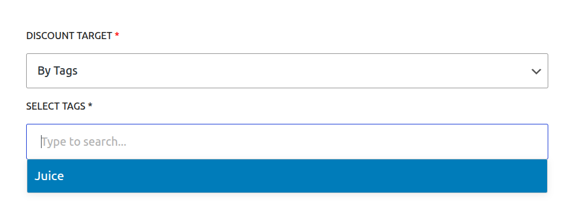

# Core Concepts: Targeting & Conditions

One of the most powerful features of CampaignBay is the ability to precisely control which products are eligible for a discount. The **Discount Target** setting, which appears on the "Add/Edit Campaign" screen, is the primary tool for defining this scope.

This guide provides a detailed explanation of each available targeting option.

## Targeting Options Overview

When you create or edit any campaign, you will see the "DISCOUNT TARGET" dropdown menu. This is where you select the core logic for how the plugin will find eligible products.

There are four methods for targeting your discounts:

1.  Entire Store
2.  By Product Category
3.  By Product
4.  By Tags

Let's explore each option in detail.

---

### 1. Entire Store

- **What it does:** This is the broadest and simplest option. When selected, the campaign's discount will be applied to **every single product** in your WooCommerce store.
- **Best for:** Store-wide sales events like Black Friday, Cyber Monday, anniversary sales, or any promotion where you want to offer a discount on everything.
- **Configuration:** No further configuration is needed. Simply select this option.

---

### 2. By Product Category

- **What it does:** This option allows you to apply a discount only to products that belong to one or more specific categories.
- **Best for:** Targeted promotions, such as "15% off all T-Shirts" or a clearance sale on your "Electronics" and "Accessories" categories. This is also great for promoting a specific brand or product line if they are organized by category.
- **Configuration:** When you select this option, a **"SELECT CATEGORIES"** field will appear. This is a searchable, multi-select input.
  - Click inside the box and start typing the name of a category to search.
  - Select one or more categories from the list.
  - You can remove a selected category by clicking the "X" on its tag.

---

### 3. By Product

- **What it does:** This is the most specific targeting option. It allows you to hand-pick individual products that will receive the discount. All other products will be ignored.
- **Best for:** Promoting a new product, running a "Deal of the Week" on a specific item, or clearing out the remaining stock of a few specific products.
- **Configuration:** When selected, a **"SELECT PRODUCTS"** field will appear.
  - Click inside the box and start typing the name of a product to search.
  - Select one or more products from the list. If you select a **variable product**, the discount will apply to all of its variations.

---

### 4. By Tags

- **What it does:** This option allows you to apply the discount to all products that share one or more specific product tags.
- **Best for:** This is a very flexible option for running promotions that span across multiple categories. For example, you could apply a `new-arrival` tag to all new products, or a `clearance` tag to items you want to sell quickly, and then target your campaign to that tag.
- **Configuration:** When selected, a **"SELECT TAGS"** field will appear.
  - Click inside the box and start typing the name of a tag to search.
  - Select one or more tags from the list.

## Next Steps

Now that you understand how to target your campaigns, let's explore another core concept of the plugin.

- **[Learn about the Discount Engine &rarr;](./understanding-the-engine.md)**
