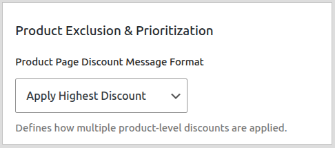
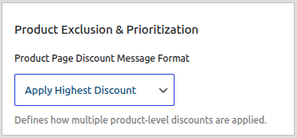

# Core Concepts: The Discount Engine & Stacking

The heart of CampaignBay is its powerful pricing engine. To get the most out of the plugin, it's essential to understand the rules it uses to calculate and prioritize discounts, especially when multiple campaigns apply to the same products.

This guide explains the different discount groups, how the engine handles conflicts, and how stacking works.

## The Discount Groups

CampaignBay organizes discounts into distinct groups that are processed in a specific order.

1.  **Product-Level Discounts:** These campaigns apply a direct price change to an individual product.

    - Includes: `Scheduled Discount`, `Early Bird Discount`.

2.  **Cart-Level Discounts:** These campaigns apply a discount based on the contents of the entire cart, like the quantity of items.

    - Includes: `Quantity Based Discount`.

3.  **Special Discounts:** These campaigns operate with their own unique logic and do not typically stack with other discounts.
    - Includes: `BOGO (Buy X Get X) Discount`.

## Step 1: Finding the Best Product-Level Discount

What happens if a product is eligible for both a "20% Off Store-Wide" (`Scheduled`) campaign and a "50% Off for the first 100 sales" (`Early Bird`) campaign?

The engine first finds the single best discount from the **Product-Level group**. This is controlled by the **"Handle Multiple Product Discounts"** setting, found in **Settings → Product Settings**.

- **Apply Highest Discount (Default):** The engine calculates the final price for all applicable `Scheduled` and `Early Bird` campaigns and applies **only the one that gives the customer the biggest saving**. In the example above, the 50% Early Bird discount would win.

- **Apply Lowest Discount:** The engine applies only the campaign that gives the customer the smallest saving.

At the end of this step, the engine has determined the single "best" product-level discount.

## Step 2: Stacking Between Discount Groups

Next, the engine decides how to handle the winning Product-Level discount and any applicable Cart-Level discounts. This is controlled by the **`Allow Stacking with Other Discount Campaigns`** setting in the **Settings → Cart Settings** tab.

#### If Stacking is OFF (Default)

The system performs a final competition:

- It compares the winning **Product-Level discount** against the **Cart-Level discount**.
- It applies **only the single, overall best discount** to the product. The other is ignored.

#### If Stacking is ON

Discounts are applied in a specific, layered "waterfall" order:

1.  **First, the winning Product-Level discount is applied.** (The best of all `Scheduled` and `Early Bird` campaigns).
2.  **Then, the Cart-Level discount is applied** to the _new, already-discounted price_ from the first step.

::: tip Stacking Example
Imagine a $100 product that qualifies for two campaigns, and stacking is **ON**:

- A **Scheduled** sale (Product-Level) offers 10% off.
- A **Quantity** discount (Cart-Level) for buying 3+ offers 20% off.

If a customer buys 3 of this item, the discounts will stack:

1.  The Product-Level discount is applied first: `$100 - 10% = $90`.
2.  The Cart-Level discount is then applied to the new subtotal: `$90 - 20% = $72`.

The final price per item will be **$72**.
:::

## The BOGO Exception

::: warning
**BOGO (Buy X Get X)** campaigns operate **independently** from the logic described above. They do not compete for the "best discount" and do not stack with Product-Level or Cart-Level campaigns.

A BOGO rule is a simple check: if the conditions are met in the cart (e.g., customer has 3 of an item for a "Buy 2 Get 1 Free" deal), the discount for the free item is applied.
:::

Understanding these core rules will help you build complex and predictable discount strategies for your store.
