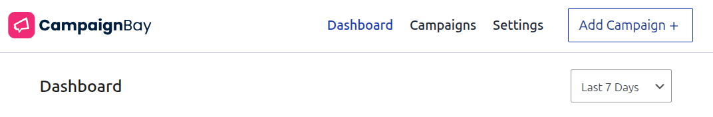
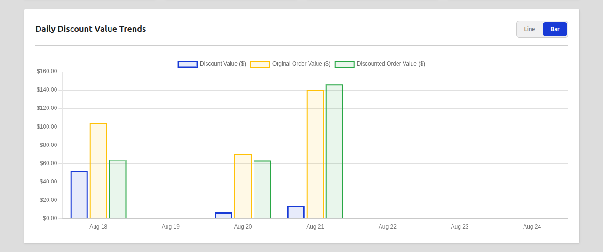
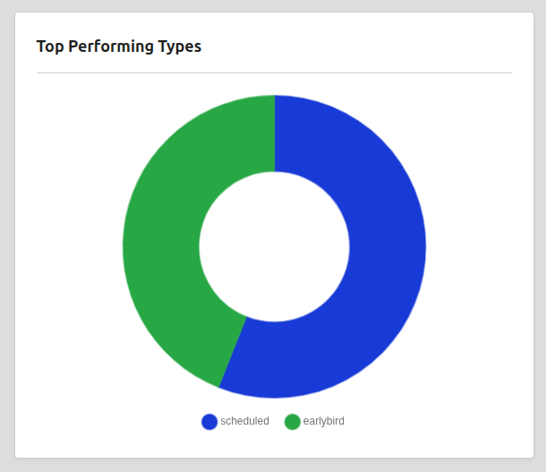
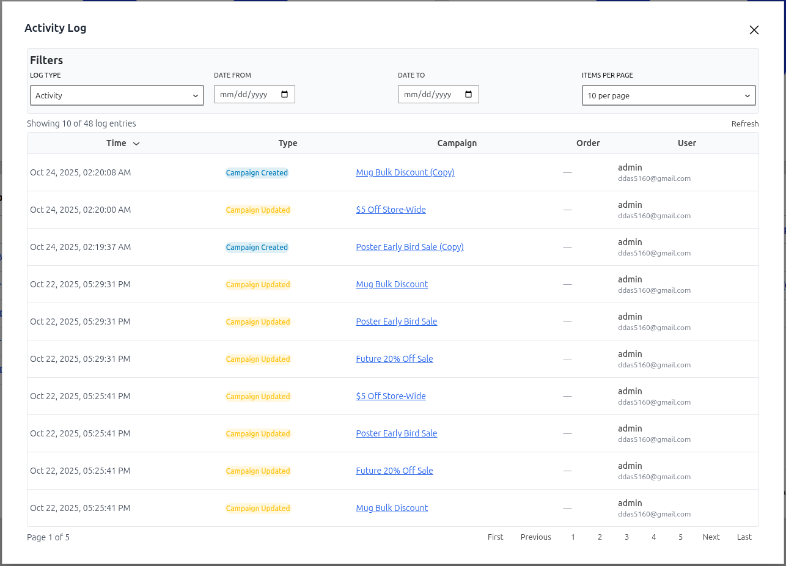

# The Dashboard

The CampaignBay Dashboard is your command center for monitoring the performance and activity of all your discount campaigns. It's designed to give you a quick, at-a-glance overview of your key metrics and a deeper insight into what's working best for your store.

### Main Navigation & Date Filtering

The header provides the main navigation for the plugin and the primary date filter that controls the data displayed in the charts and KPI cards below.



- **Navigation:** Quickly jump between the `Dashboard`, `Campaigns` list, and `Settings`.
- **Add Campaign:** The primary button to start creating a new campaign.
- **Date Filter:** Choose a time period to analyze your campaign performance. You can select pre-defined ranges like "Last 7 Days" or "Last 30 Days." This filter affects all KPI cards and charts on the page.

## Key Performance Indicators (KPIs)

These four cards at the top of the page give you the most important metrics for a quick health check of your promotional activities.


1.  **Active Campaigns:** A live count of all campaigns that currently have the "Active" status. This number is **not** affected by the date filter.
2.  **Total Discounted Amount:** The total monetary value of all discounts applied to successful orders within the selected time period.
3.  **Discounted Orders:** The total number of unique orders that had at least one CampaignBay discount applied.
4.  **Sales from Campaigns:** The total revenue from all orders that included a CampaignBay discount.

Each of the financial KPIs includes a green percentage below it, showing the trend compared to the previous equivalent period (e.g., if you select "Last 7 Days," it compares to the 7 days prior).

## Performance Charts

### Daily Discount Value Trends

This chart gives you a visual representation of your campaign performance over time, helping you identify which days had the most sales and discount activity.



- **Interactive Legend:** You can hide or show data streams by clicking on their labels in the legend.
  - **Discount Value ($):** The total sum of discounts given out each day.
  - **Original Order Value ($):** What the total value of the discounted orders _would have been_ without your campaigns.
  - **Discounted Order Value ($):** The final, actual revenue from these orders after discounts were applied.
- **Toggle Chart Type:** You can switch between a **Bar** chart and a **Line** chart for your preferred visualization.

### Top Performing Campaigns

This chart helps you instantly identify which specific campaigns are providing the most value by showing the total discount amount attributed to each.


The donut chart shows a breakdown of your top campaigns during the selected time period. Hover over a segment to see the campaign name and the exact value of the discounts it generated.

### Top Performing Types

This strategic chart shows you which _kind_ of campaign is most effective for your store.



This chart breaks down the total sales from campaigns by their type (`Scheduled`, `Quantity`, `EarlyBird`, etc.). It helps you answer important questions like, "Do my Quantity discounts generate more overall revenue than my Scheduled sales?" so you can refine your marketing strategy.

## Actionable Widgets

The final section of the dashboard is focused on operational awareness and recent changes.

### Live Campaigns & Upcoming Campaigns

These widgets provide immediate operational awareness, showing you what's running now and what's scheduled to start soon.


- **Live Campaigns:** This list shows all campaigns that are currently in the `Active` state, ordered by which one will end soonest.
- **Upcoming Campaigns:** This lists the next few campaigns that have a status of `Scheduled`, showing you what's next in your promotional calendar. The "Add New Campaign" button provides a quick shortcut.

### Recent Activity

This widget provides a quick audit trail of the most recent administrative actions taken on your campaigns.


It shows a timestamped list of when campaigns were created or updated, and by which user. Clicking on a campaign name will take you directly to its edit screen.

- **View Full Activity Log:** Clicking this link opens a detailed, filterable, and paginated modal window with the complete history of all campaign-related activities.



## Next Steps

Now that you're familiar with the Dashboard, let's dive into the Core Concepts that power the plugin.

- **[Learn about the Discount Engine &rarr;](./core-concepts/understanding-the-engine.md)**```
