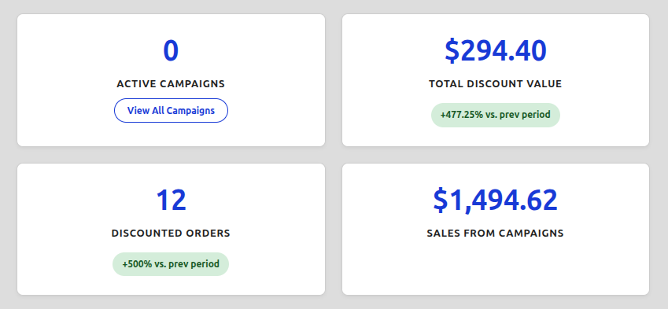
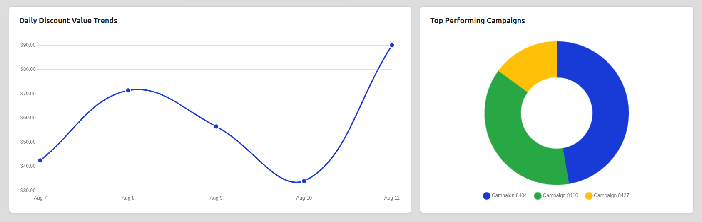
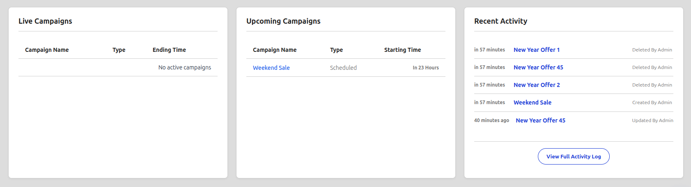

# Dashboard Overview

The CampaignBay Dashboard is your mission control for all discount-related activities. It is the first screen you see after installation and provides a powerful, at-a-glance overview of your campaign performance, trends, and current status.

This guide will walk you through each section of the dashboard.

## 1. Key Performance Indicators (KPIs)

This top row of cards gives you a 5-second health check of your campaigns' performance over the last 30 days. The percentage change shown is a comparison to the previous 30-day period, helping you understand your growth.

-   **Active Campaigns:** A live count of campaigns that are currently active on your store (`status = 'Active'`). This helps you see how many promotions are running right now.
-   **Total Discount Value:** The total monetary value of all discounts successfully applied to completed orders. This metric shows you exactly how much value your campaigns have provided to your customers.
-   **Discounted Orders:** The total number of unique orders that have had at least one CampaignBay discount applied. This is a key metric for understanding the reach of your promotions.
-   **Sales from Campaigns:** The total revenue (including products, shipping, and taxes) generated from orders that included one of your campaign discounts. This helps you see the direct sales impact of your promotions.

## 2. Performance Trends

This section helps you visualize your performance over time and understand which strategies are most effective. You can use the dropdown on the right to change the time period for both charts (e.g., Last 7 Days, Last 30 Days, This Year).

-   **Discount Value Trends (Line Chart):** This chart shows the total discount value given out each day. It's perfect for spotting trends, seeing the immediate impact of a new sale, and understanding the daily rhythm of your promotions.
-   **Most Impactful Types (Pie Chart):** This powerful strategic chart answers the question, "What *kind* of sale actually makes me the most money?" It shows you what percentage of your total campaign-driven revenue comes from Quantity discounts vs. Scheduled discounts, helping you plan more effective future campaigns.

## 3. Actionable Insights

This final section provides real-time information about your campaigns and allows you to take immediate action without leaving the dashboard.

-   **Live & Upcoming Campaigns:**
    -   **Currently Active:** A list of all campaigns currently running on your site. The **toggle switch** next to each campaign is an interactive button. You can click it to instantly deactivate a live campaign without needing to go to the edit screen.
    -   **Starting Soon:** A list of your next few scheduled campaigns, so you can always see what promotions are on the horizon.
-   **Recent Activity:** A log of the most recent administrative actions performed on your campaigns (e.g., a campaign was created, updated, or activated). Each entry includes who made the change, when they made it, and a direct link to edit the campaign in question.

## What's Next?

Now that you understand the dashboard, it's time to learn how to create the different types of campaigns that will populate it with data. We'll start with the most common type, the "Scheduled Discount."

**➡️ Next Step: [Campaign Types: Your First Campaign (Scheduled)](../campaign-types/first-campaign-scheduled.md)**