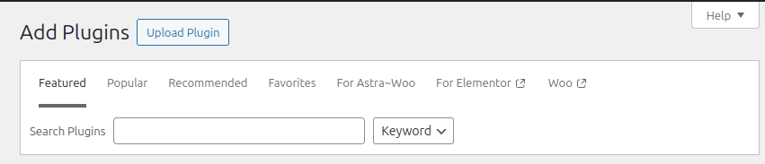
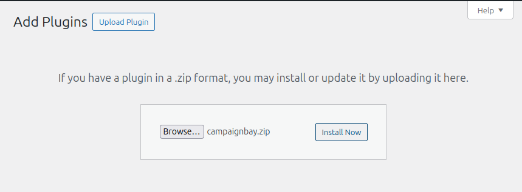
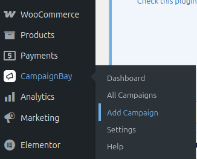

# Installation

Installing CampaignBay is a straightforward process. Follow the steps below to get started and unlock powerful new discount tools for your store.

## Prerequisites

Before you begin, please ensure your WordPress environment meets the following requirements:

-   **WordPress:** Version 5.8 or higher.
-   **WooCommerce:** Version 6.0 or higher.
-   **WP-Cron:** Must be enabled.

CampaignBay relies on the built-in WordPress Cron system (`WP-Cron`) to automatically activate and deactivate scheduled campaigns. If WP-Cron is disabled on your site (e.g., via the `DISABLE_WP_CRON` constant in your `wp-config.php` file), the plugin will prevent activation and show an error message.

## Installation Steps

### 1. Download the Plugin

First, download the `campaignbay.zip` file from your purchase receipt or the location where you obtained the plugin.

### 2. Upload to WordPress

Navigate to your WordPress admin dashboard. In the left-hand menu, go to **Plugins > Add New**. At the top of the "Add Plugins" page, click the **"Upload Plugin"** button.

### 3. Choose and Install

A file upload form will appear. Click the **"Choose File"** button and select the `campaignbay.zip` file you downloaded in the first step. After selecting the file, click the **"Install Now"** button.

### 4. Activate the Plugin

WordPress will upload and unpack the plugin. Once the installation is complete, you will see a success message. Click the blue **"Activate Plugin"** button to finish the process.

## What's Next?

That's it! CampaignBay is now installed and ready to go. A new "Campaigns" menu item, featuring the CampaignBay icon, will appear in your main WordPress admin sidebar.

The best way to get started is to create your first promotion. Our step-by-step guide will walk you through creating a simple, time-based sale in just a few clicks.

**➡️ Next Step: [Creating Your First Campaign](./first-campaign.md)**