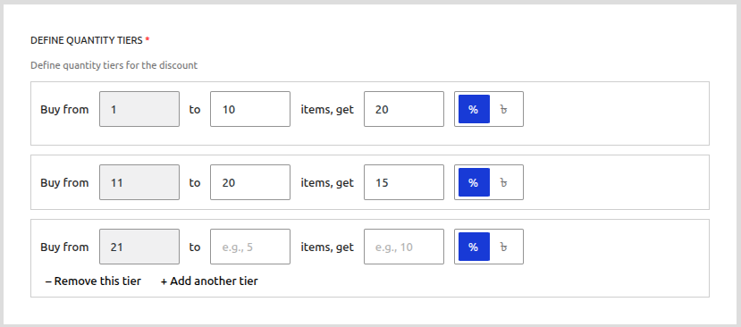

# All Campaign Types Explained

CampaignBay offers several distinct campaign types to cover a wide range of promotional strategies. This guide explains each type and the specific fields associated with them.

[[toc]]

## Common Fields

The following fields are present in almost every campaign type and control the fundamental aspects of the promotion.

### Campaign Title

This is the public name for your discount. It will appear in the cart totals and on any reports, so make it clear and descriptive (e.g., "Black Friday Sale," "Bulk Discount - T-Shirts").

### Select For Users (Targeting)

This crucial setting determines which products are eligible for the discount.

-   **Entire Store:** The discount applies to every product in your WooCommerce catalog.
-   **Specific Category:** A new field will appear allowing you to select one or more product categories. The discount will only apply to products within those categories.
-   **Specific Products:** A new field will appear allowing you to search for and select one or more specific products. The discount will only apply to the products you choose.

### Campaign Duration (Scheduling)

This section controls when your campaign is active.

-   **Enable Scheduling Toggle:**
    -   When **OFF**, the campaign becomes active the moment you save it.
    -   When **ON**, you can set a future start date and a specific end date.
-   **Start Time / Date:** The exact moment the campaign will automatically activate.
-   **End Time / Date:** The exact moment the campaign will automatically expire.

All schedules are based on the timezone configured in your main WordPress settings (`Settings > General`).

---

## 1. Scheduled Discount

This is the most straightforward campaign type, perfect for general store-wide sales or promotions on specific products/categories.

### Use Cases
-   Holiday sales (e.g., Black Friday, New Year's)
-   Weekend flash sales
-   Clearing out old inventory with a simple discount

### Configuration

A Scheduled Discount uses only two main configuration sections:

**1. Discount Value**

Set the value of the discount that will be applied to all eligible products.

-   **Value:** The numerical value of the discount (e.g., `20`).
-   **Type (% or Fixed):** Choose whether the value is a percentage off the product's price or a fixed monetary amount.

**2. Campaign Duration**

For this campaign type, the **"Enable Scheduling"** toggle is **required and cannot be turned off**. You must provide a start and end date for the promotion.

---

## 2. Quantity Based Discount

This type allows you to create tiered pricing that rewards customers for buying in bulk. The discount per item changes based on the quantity in the customer's cart.

### Use Cases
-   Wholesale or bulk pricing
-   Encouraging customers to buy more of a single item
-   "Buy 2 save 10%, Buy 4 save 20%!" style offers

### Configuration

**1. Define Quantity Tiers**

This is the primary configuration for a Quantity Discount. You can create one or more tiers.

-   **Buy From (Min):** The minimum quantity of the item a customer must have in their cart for this tier to apply.
-   **to (Max):** The maximum quantity for this tier. Leave this blank on your last tier to mean "and up."
-   **items, get (Value):** The discount value for products in this quantity range.
-   **Type (% or Fixed):** Whether the discount is a percentage or a fixed amount **per item**.
-   **+ Add another tier:** Click this to add more pricing levels.

**Example Tier Setup:**
-   **Tier 1:** Min `1`, Max `5`, Value `10%`
-   **Tier 2:** Min `6`, Max `(blank)`, Value `20%`

This configuration means "Buy 1 to 5 items, get 10% off each. Buy 6 or more, get 20% off each."

---

## 3. Early Bird Discount

This campaign type creates urgency by offering tiered discounts to a limited number of customers. The discount is based on the **total number of orders** that have already used the campaign, not the quantity in a single cart.

### Use Cases
-   Product launches ("First 50 customers get 30% off!")
-   Flash sales to drive immediate traffic
-   Rewarding your most loyal, fast-acting customers

### Configuration

**1. Define Early Bird Tiers**

The configuration looks similar to a quantity discount, but the fields have a different meaning.

-   **Up to first (Max Orders):** This is the crucial field. It defines the maximum number of **orders** that can receive this tier's discount. For "the first 100 orders," you would enter `100`.
-   **orders, get (Value):** The discount value for this tier.
-   **Type (% or Fixed):** Whether the discount is a percentage or a fixed amount.

**Example Tier Setup:**
-   **Tier 1:** Max Orders `100`, Value `30%`
-   **Tier 2:** Max Orders `300`, Value `15%`

This configuration means:
-   The first 100 successful orders will receive a 30% discount.
-   Orders #101 through #300 will receive a 15% discount.
-   After 300 total orders, the campaign effectively expires.