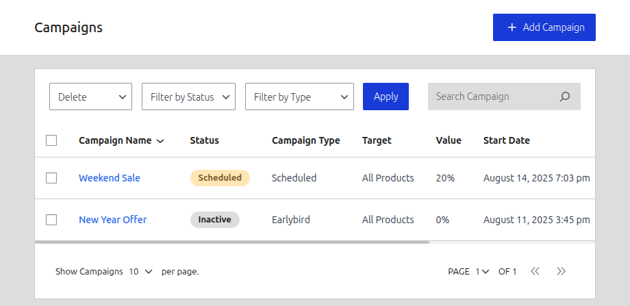
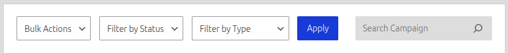

# Managing Your Campaigns

The "All Campaigns" screen is where you will manage, organize, and review all the discounts you have created. You can access it by navigating to **Campaigns > All Campaigns**.

## The Campaign List Table

The main part of the screen is the list table, which provides key information about each campaign at a glance.

-   **Campaign Name:** The title of your campaign. Clicking this will take you to the edit screen.
-   **Status:** Shows the current state of the campaign (e.g., Active, Scheduled, Expired, or Inactive).
-   **Discount Type:** The core logic of the campaign (e.g., Scheduled, Quantity).
-   **Target:** Which products the campaign applies to (e.g., Entire Store).
-   **Value:** The discount value.
-   **Start/End Date:** The scheduled duration of the campaign.
-   **Usage:** The total number of times the campaign has been applied to a successful order.
-   **Action:** A menu with quick actions like "Edit" and "Delete" for that specific campaign.

## Filtering and Searching

To quickly find specific campaigns, use the controls at the top of the table.

-   **Filter by Status:** Show only campaigns with a specific status (e.g., show only "Active" campaigns).
-   **Filter by Discount:** Show only campaigns of a specific type (e.g., show only "Quantity" discounts).
-   **Search Campaign:** Type a name or keyword into the search box to find a campaign by its title.

After selecting your filters or entering a search term, click the **"Apply"** button to update the list.

## Bulk Actions

You can perform actions on multiple campaigns at once using the bulk action tools.

1.  **Select Campaigns:** Use the checkboxes on the left-hand side of the table to select the campaigns you want to modify. You can use the checkbox in the header to select all campaigns on the current page.
2.  **Choose an Action:** Select an action from the "Bulk Actions" dropdown (e.g., "Activate," "Deactivate," "Delete").
3.  **Apply:** Click the **"Apply"** button.

The footer of the table will also update to show how many items you have selected and provide a quick delete icon.