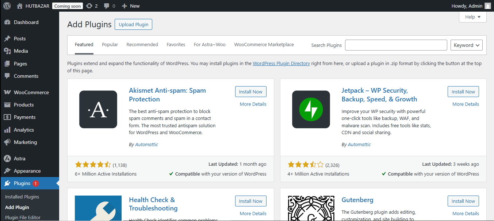
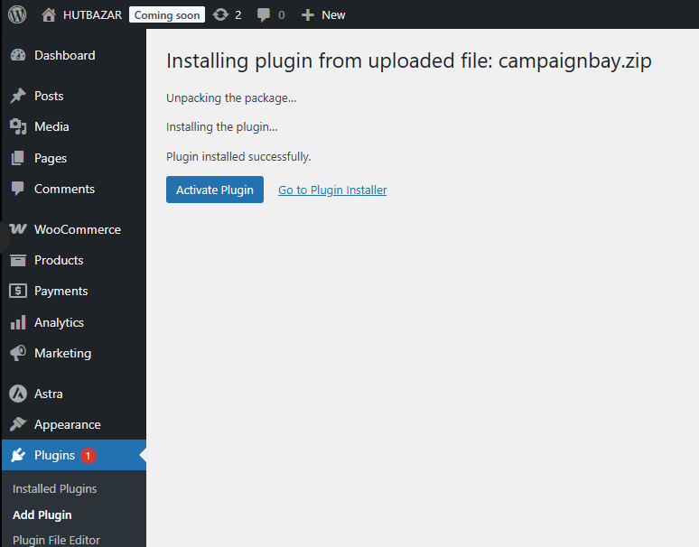
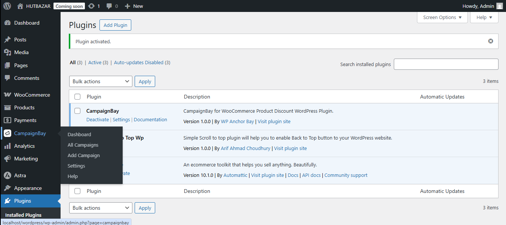

# Installation

Welcome to CampaignBay! Installing the plugin is a straightforward process. This guide will walk you through the necessary steps to get up and running using the plugin's `.zip` file.

## Requirements

Before you begin, please ensure your WordPress environment meets the following minimum requirements:

- **WordPress:** Version 5.8 or higher
- **PHP:** Version 7.0 or higher
- **WooCommerce:** The WooCommerce plugin must be installed and activated.

::: tip
If you are unsure about any of these requirements, please contact your hosting provider for assistance.
:::

## Installation Steps

Follow these steps to install CampaignBay from the `.zip` file.

### Step 1: Download the Plugin

First, ensure you have the latest version of the CampaignBay plugin. You should have a file named `campaignbay.zip` saved to your computer.

### Step 2: Navigate to the Plugin Uploader

Log in to your WordPress admin dashboard. In the left-hand menu, navigate to **Plugins → Add New**.

<!--  -->

### Step 3: Upload the Plugin File

On the "Add Plugins" page, click the **Upload Plugin** button at the top of the screen. This will reveal the file upload form.

Click **Choose File** and select the `campaignbay.zip` file from your computer.

### Step 4: Install and Activate

After selecting the file, click the **Install Now** button. WordPress will upload and unpack the plugin.

<!--  -->

Once it's finished, you will see a success screen. Click the blue **Activate Plugin** button to complete the installation.

### Step 5: Verify the Installation

That's it! The installation is complete. You will be redirected to the main Plugins page, and you should see a "Plugin activated" confirmation message.

To verify that CampaignBay is ready to use, look for the new **"CampaignBay"** menu item in your WordPress admin sidebar.

## Troubleshooting

If you encounter an error during activation, it is most likely due to one of the following reasons:

- **WooCommerce is not active:** CampaignBay is an add-on for WooCommerce and cannot run without it. Please ensure WooCommerce is installed and activated before activating CampaignBay.

## Next Steps

Now that you've successfully installed the plugin, the best place to start is the Dashboard.

- **[Explore the Dashboard &rarr;](./dashboard.md)**
