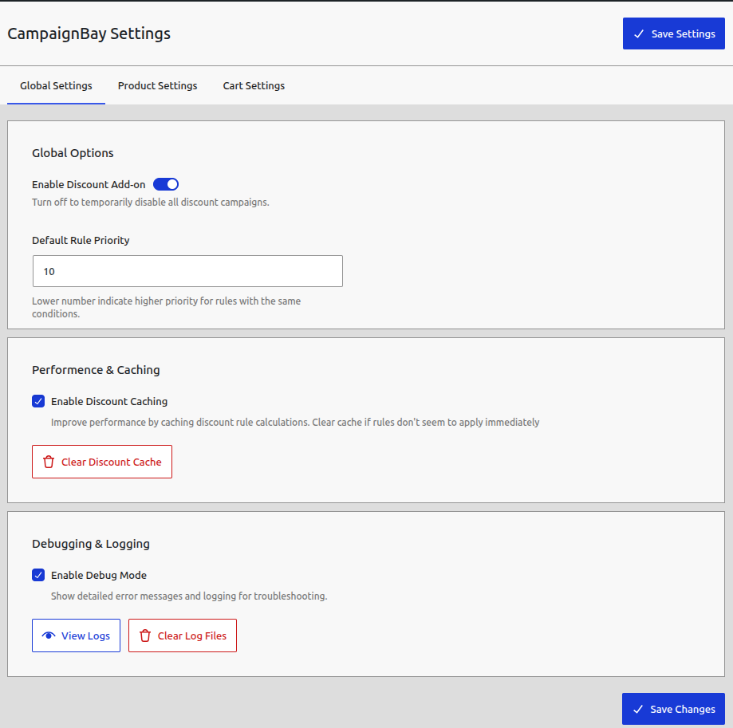
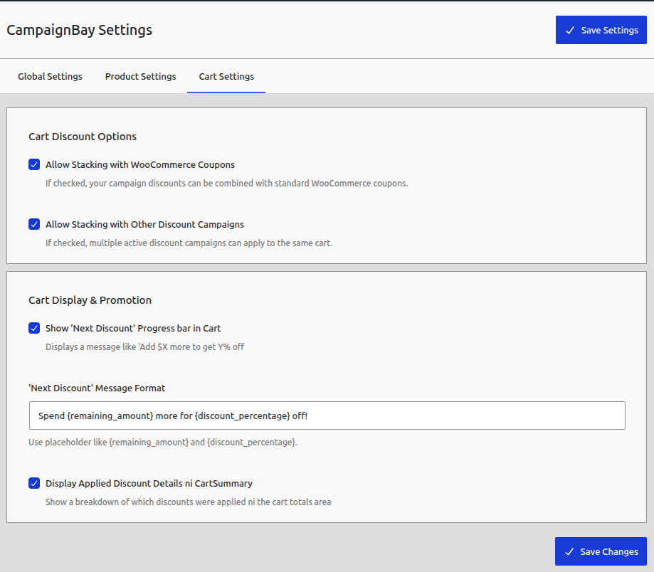

# All Settings Explained

The main settings for CampaignBay can be found by navigating to **Campaigns > Settings**. This area allows you to configure the global, default behavior of the plugin for your entire store. The settings are organized into several tabs for clarity.

[[toc]]

## 1. Global Settings

This tab contains the master controls and foundational options for the entire plugin.

### General Options

- **Enable Discount Add-on:** This is the master switch for the plugin. If you turn this off, all CampaignBay campaigns will be temporarily disabled site-wide without you having to deactivate them individually. This is useful for quickly troubleshooting or pausing all promotions at once.

- **Discount Calculation Mode:** This setting determines how discounts interact with your store's taxes.
  - **After Tax:** The discount is calculated based on the product price _after_ taxes have been included.
  - **Before Tax:** The discount is calculated based on the product price _before_ taxes are added.

### Campaign Stacking Control

- **Allow Campaign Stacking:** This critical setting determines how multiple campaigns interact with each other.
  - **Disabled (Default):** Only one campaign discount is applied per product. The system selects the best discount based on your conflict resolution setting.
  - **Enabled:** Multiple campaigns can work together in a specific hierarchy:
    1. **Step 1:** The best Scheduled or Early Bird discount is applied to the base price
    2. **Step 2:** Quantity discounts are calculated and applied on top of the already discounted price
    3. **Step 3:** WooCommerce coupons can be applied (if enabled in cart settings)

### Performance & Caching

- **Enable Discount Caching:** It is highly recommended to keep this enabled. This feature stores the results of active campaign queries in a temporary cache, which significantly speeds up page loading times for your customers, especially on the shop and product pages. The cache is automatically cleared whenever you save, activate, or deactivate a campaign, ensuring your changes are always reflected.
- **Clear Discount Cache:** Manually clears the campaign cache. You should only need to use this for troubleshooting if a discount doesn't appear to be applying correctly immediately after a change.

### Debugging & Logging

- **Enable Debug Mode:** This enables detailed logging for troubleshooting purposes. When active, the plugin will write detailed information about its processes to a log file.
- **Log Level:** Controls how much information is logged when debug mode is on.
- **View Logs / Clear Log Files:** These buttons provide direct access to view and manage the plugin's log files from within your WordPress admin.

## 2. Product Settings

This tab controls how discounts are displayed on your **single product** and **shop/archive** pages.

- **Show Discounted Price on Product Page:** When enabled, this will display prices in a "sale" format, with the original price crossed out and the new, lower price shown (e.g., <del>$50</del> $40). If disabled, only the final discounted price will be shown without the original.

- **Product Page Discount Message Format:** Customize the "You save..." message that appears on the product page when a campaign is active. You can use the following placeholders, which will be automatically replaced with the correct values:

  - `{percentage_off}`: The total saving as a percentage.
  - `{amount_off}`: The total monetary saving, formatted in your store's currency.

- **Automatically Exclude Sale Items from Campaigns:** This is a crucial safety feature, recommended to be kept **enabled**. It prevents "double discounting" by ensuring that CampaignBay will not apply any of its discounts to a product that you have already put on sale using the native WooCommerce "Sale Price" field.

- **Handle Multiple Product Discounts:** This setting resolves conflicts if two or more of your campaigns apply to the same product.
  - **Apply Highest Discount (Recommended):** The customer gets the best possible deal (the lowest final price).
  - **Apply Lowest Discount:** The customer gets the smallest discount available.

## 3. Cart Settings

This tab controls how discounts and notices behave within the WooCommerce **cart page**.

- **Allow Stacking with WooCommerce Coupons:** This is a critical setting for your promotion strategy.

  - If **enabled**, customers can use a standard WooCommerce coupon code _in addition_ to an automatic campaign discount that is already active in their cart.
  - If **disabled**, the system will enforce a "one or the other" rule. If a campaign discount is active, it will prevent a coupon from being applied. If a coupon is applied first, it will prevent your campaign discounts from activating.

- **'Next Discount' Progress Bar in Cart:** When a customer has a quantity-based discount item in their cart but hasn't reached the next discount tier, this enables a helpful notice under the product (e.g., "Add 2 more to get 20% off!"). This is a powerful upsell tool.

- **'Next Discount' Message Format:** Customize the text for the progress bar notice. You can use the following placeholders:

  - `{remaining_quantity}`: The number of additional items needed to reach the next tier.
  - `{discount_value}`: The discount offered at the next tier.

- **Display Applied Discount Details in Cart Summary:** When enabled, this adds a line item to the "Cart Totals" section for each active campaign, showing the customer a clear breakdown of their savings (e.g., "Summer Sale: -$10.00"). If disabled, only the product prices will be changed, without a summary in the totals.

## 4. Advanced Technical Settings

### Campaign Stacking Hierarchy

When campaign stacking is enabled, the system follows a specific order of operations:

1. **Base Price Calculation:** The product's regular price is determined
2. **Simple Discounts:** Scheduled and Early Bird discounts are evaluated and the best one is applied
3. **Quantity Discounts:** If applicable, quantity-based discounts are calculated and applied on top
4. **WooCommerce Coupons:** Finally, any valid coupon codes are applied

This hierarchy ensures predictable and fair discount calculations while maximizing customer savings.

### Conflict Resolution

When multiple campaigns could apply to the same product:

- **Highest Discount Priority:** The system automatically selects the campaign offering the greatest savings
- **Lowest Discount Priority:** The system selects the campaign offering the smallest savings
- **Manual Override:** Admins can manually set campaign priorities in advanced settings

### Performance Optimization

- **Cache Management:** Automatic cache invalidation when campaigns are modified
- **Database Optimization:** Efficient queries that minimize impact on site performance
- **Background Processing:** Order tracking and status updates happen in the background

## 5. Troubleshooting Settings

### Debug Mode

When enabled, debug mode provides detailed logging for:

- Campaign activation/deactivation
- Discount calculations
- Order tracking (for Early Bird campaigns)
- Cache operations
- Performance metrics

### Log Management

- **Real-time Logs:** View logs as they're generated
- **Log Rotation:** Automatic log file management
- **Export Functionality:** Download logs for external analysis

### Performance Monitoring

- **Cache Hit Rates:** Monitor cache effectiveness
- **Query Performance:** Track database query efficiency
- **Memory Usage:** Monitor plugin resource consumption

---

## 🚀 **Next Steps**

Now that you understand all the settings, explore these resources:

- **[Complete Feature Overview](/reference/complete-features)** - Comprehensive technical documentation
- **[First Campaign Tutorial](/campaign-types/first-campaign-scheduled)** - Create your first discount campaign
- **[Dashboard Overview](/getting-started/dashboard-overview)** - Master the admin interface

---

_Configure CampaignBay to work perfectly for your store's unique needs and start driving sales with powerful, automated discounts!_
