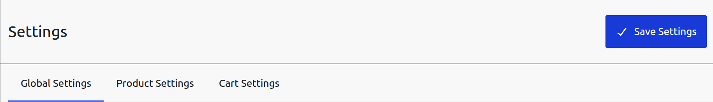
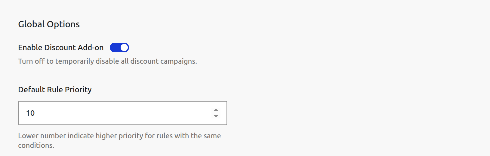
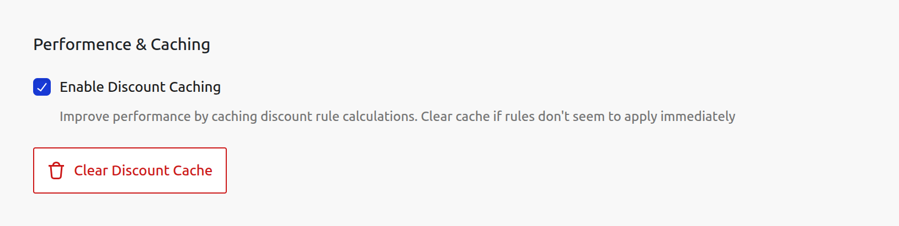
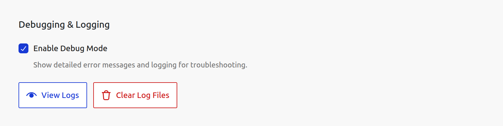
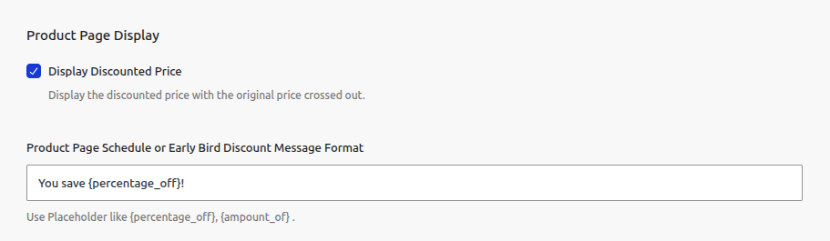
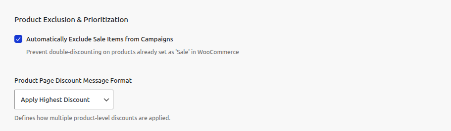
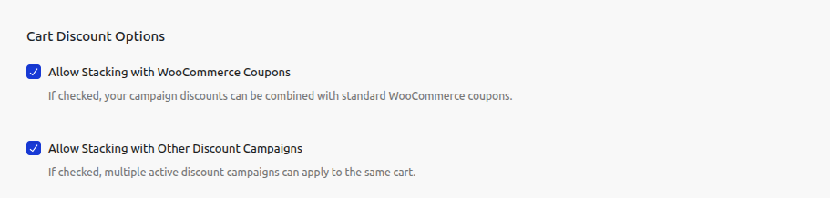
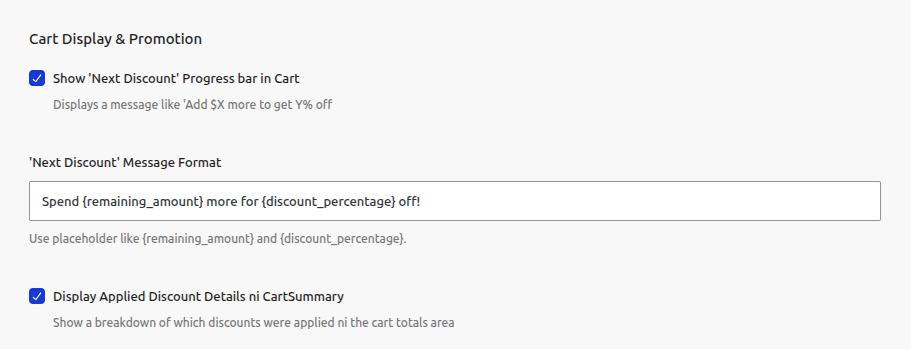

# Settings

The Settings page contains all the global configuration options for the CampaignBay plugin. These settings control the default behavior of the discount engine, performance, display options, and more.

The settings are organized into logical tabs for easy navigation. To save any changes you make, click the **Save Settings** button at the top right of the page.

---

## Global Settings

The "Global Settings" tab contains the main operational controls for the entire plugin.

### Global Options

This section contains the master switch for the plugin and the default priority for your campaign rules.

- **Enable Discount Add-on:** This is the master "on/off" switch for CampaignBay. When this toggle is **ON**, the plugin is active and will apply discounts to your store. When it is **OFF**, the entire pricing engine is disabled, and no discounts will be calculated or applied. This is a safe way to temporarily disable all campaigns at once without deactivating the plugin.

- **Default Rule Priority:** This sets a default priority number for new campaigns. This is used by the discount engine to resolve conflicts when multiple campaigns could apply to the same product. A **lower number means a higher priority**. For example, a rule with priority `10` will be applied before a rule with priority `20`. The default is `10`.

### Performance & Caching

These settings control the plugin's caching mechanisms, which are crucial for maintaining a fast storefront.

- **Enable Discount Caching:** This option is **highly recommended** and is enabled by default. It activates the plugin's caching system, which stores the list of active campaigns in a temporary cache (a WordPress transient). This dramatically improves performance by preventing the plugin from querying the database on every single page load.

- **Clear Discount Cache:** If you ever make a change to a campaign and do not see it reflected on the frontend immediately, you can click this button to manually clear the campaign cache. The cache is automatically cleared whenever a campaign is saved, but this button provides a manual override for troubleshooting.

### Debugging & Logging

This section provides tools for troubleshooting and support.

- **Enable Debug Mode:** When this is checked, the plugin will write detailed information about its processes (like which campaigns were found and what prices were calculated) to a dedicated log file. This is an invaluable tool for diagnosing issues.

- **View Logs:** This button opens a modal window that displays the contents of today's log file in real-time. The newest entries appear at the top. This allows you to see what the plugin is doing without needing to access the server's file system.

- **Clear Log Files:** This button will permanently delete all `.log` files created by the CampaignBay plugin. This is useful for clearing out old data after a troubleshooting session is complete. You will be asked to confirm this action.

---

## Product Settings

The "Product Settings" tab controls how discounts are displayed on your shop and single product pages, and how the plugin handles potential conflicts.

### Product Page Display

These settings manage the visual elements of your discounts on the frontend before the customer reaches the cart.

- **Display Discounted Price:** When this is enabled (default), products with an active campaign discount will show a "sale" price format, with the original price crossed out and the new, lower price displayed. If you disable this, only the final, discounted price will be shown without indicating that it was on sale.

- **Product Page Schedule or Early Bird Discount Message Format:** This field allows you to customize the promotional message that appears on a single product page for "Scheduled" and "Early Bird" discounts. You can use dynamic placeholders which will be automatically replaced with the calculated values.

  - `{percentage_off}`: Will be replaced by the calculated percentage discount (e.g., "20%").
  - `{amount_off}`: Will be replaced by the calculated fixed amount saved (e.g., "5.00৳").

  _Example: The default "You save {percentage_off}!" will display as "You save 20%!" on the product page._

### Product Exclusion & Prioritization

These are important rules that control how the discount engine behaves when it encounters conflicts.

- **Automatically Exclude Sale Items from Campaigns:** This is a crucial setting to prevent "double-discounting." When this is enabled (default), CampaignBay will **not** apply its own discount to any product that already has a native WooCommerce "Sale Price".

- **Product Page Discount Message Format (Conflict Resolution):** This setting tells the plugin what to do when **multiple** of your campaigns could apply to the same product.
  - **Apply Highest Discount:** This is the default and most common setting. The plugin will calculate the final price for all applicable campaigns and apply only the one that gives the customer the biggest discount (i.e., the lowest final price).
  - **Apply Lowest Discount:** The plugin will apply only the campaign that gives the customer the smallest discount.
  - **Apply Based on Priority:** (If you implement this) This would use the "Default Rule Priority" number to decide which campaign wins.

---

## Cart Settings

The "Cart Settings" tab controls how your discounts interact with the WooCommerce cart, including stacking rules and promotional messages.

### Cart Discount Options

These settings define how your campaigns interact with other discounts, both from WooCommerce itself and from other CampaignBay campaigns.

- **Allow Stacking with WooCommerce Coupons:** This is a powerful two-way rule.

  - When **enabled**, customers can use a native WooCommerce coupon code in addition to any automatic discounts applied by CampaignBay.
  - When **disabled** (default), the two systems are mutually exclusive. If a CampaignBay discount is active in the cart, a user will be blocked from applying a coupon. Conversely, if a user has already applied a coupon, CampaignBay discounts will not be applied. A clear notice is shown to the customer in both cases.

- **Allow Stacking with Other Discount Campaigns:** This setting controls how different _types_ of CampaignBay campaigns interact.
  - When **enabled**, discounts can be layered. For example, a "Scheduled" discount could be applied first, and then a "Quantity" discount could be applied on top of that already-discounted price.
  - When **disabled** (default), only the single best discount from any applicable campaign will be applied to a product.

### Cart Display & Promotion

These settings control the messages and promotional elements displayed on the cart page.

- **Show 'Next Discount' Progress bar in Cart:** When enabled, this will display a dynamic, inline message under a product in the cart if it's part of a "Quantity Based Discount". It intelligently prompts the user to add more items to their cart to reach the next discount tier.

- **'Next Discount' Message Format:** Customize the text of the "add more to save" message. You can use dynamic placeholders:

  - `{remaining_quantity}`: Will be replaced by the number of additional items the customer needs to add (e.g., "2").
  - `{discount_percentage}`: Will be replaced by the discount they will receive at the next tier (e.g., "15% off").

- **Display Applied Discount Details in Cart Summary:** This is a highly recommended setting. When enabled, the cart totals section will show a separate, itemized line for each campaign that contributed to the total savings. This provides maximum clarity for the customer. If disabled, only the final reduced total will be shown without a breakdown.

---

## Next Steps

You have now learned about all the global settings. The final step is to read our guide on the core concepts that power the discount engine.

- **[Learn about the Discount Engine &rarr;](./core-concepts/understanding-the-engine.md)**
