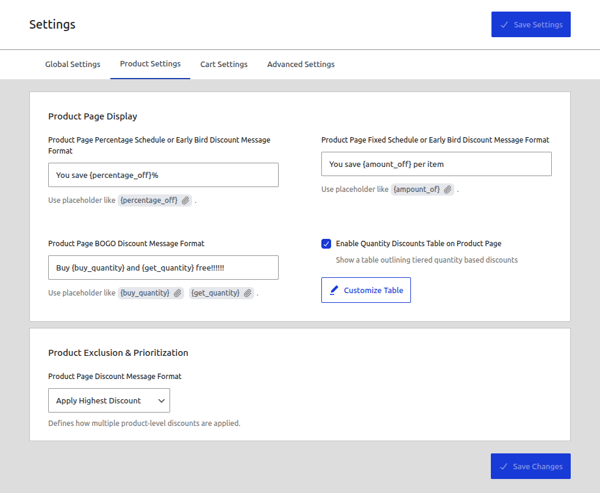
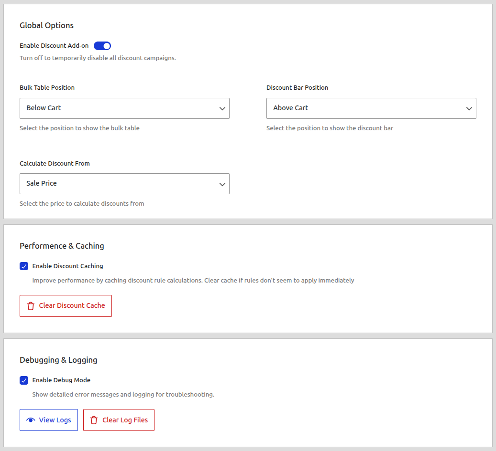
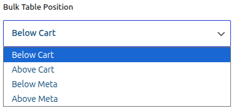
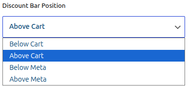
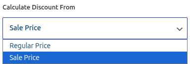
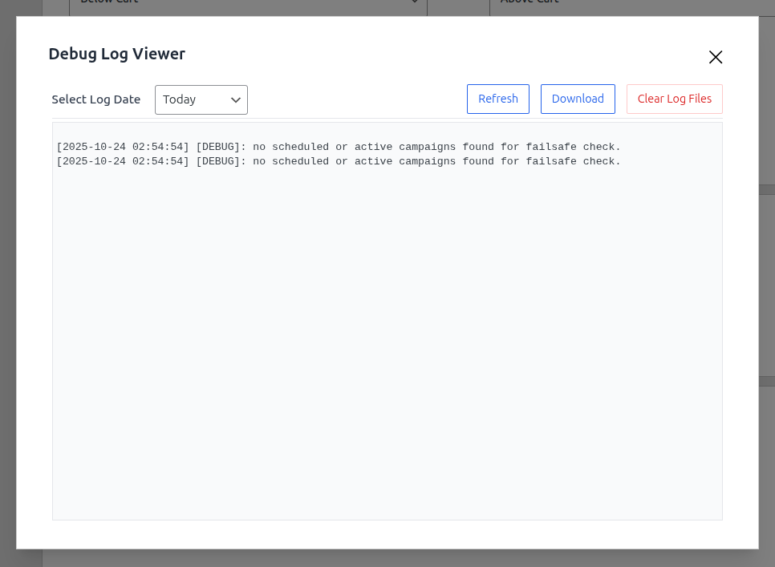
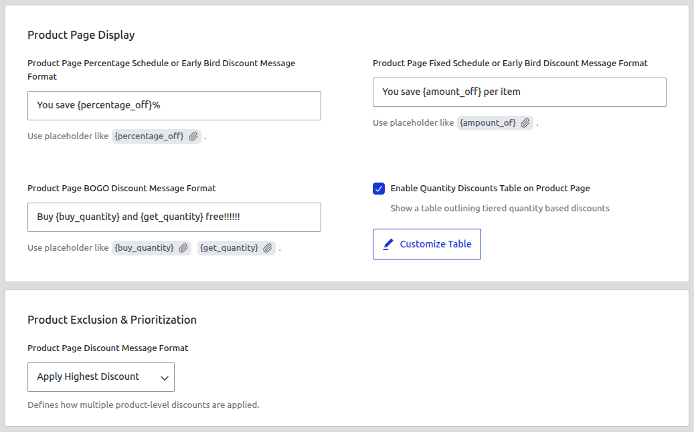
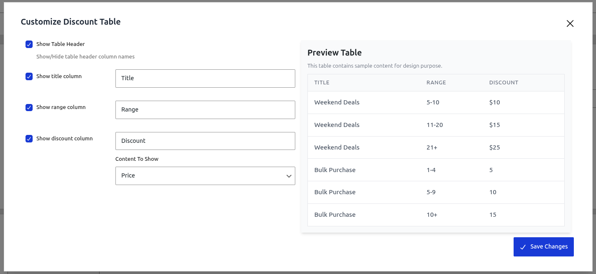
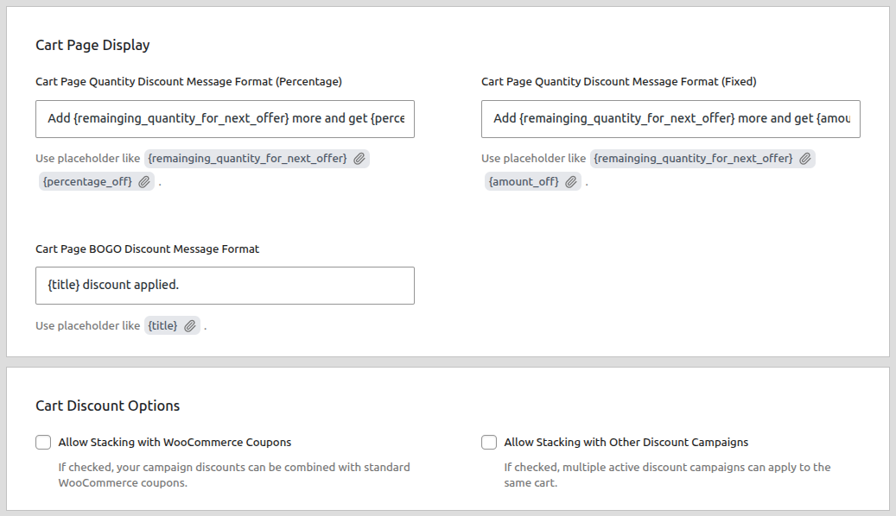
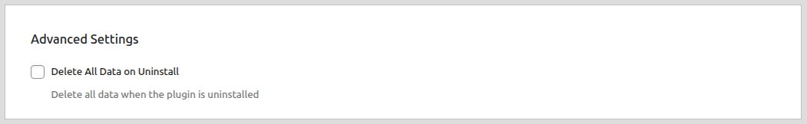

# Settings

The Settings page contains all the global configuration options for the CampaignBay plugin. These settings control the default behavior of the discount engine, display options, performance, and more.

The settings are organized into logical tabs for easy navigation. After making changes on any tab, click the **Save Settings** button at the top right to apply them.

## Global Settings

The "Global Settings" tab contains the main operational controls for the entire plugin, affecting how discounts are calculated and displayed across your store.

### Global Options

#### Enable Discount Add-on

This is the master "on/off" switch for CampaignBay.

- **ON (Toggled Right):** The plugin is active and will apply discounts to your store.
- **OFF (Toggled Left):** The entire pricing engine is disabled. No discounts will be calculated or applied. This is a safe way to temporarily pause all campaigns at once without deactivating the plugin.

#### Bulk Table Position

This setting controls the default location on the product page where the "Quantity Discount" table is displayed.

- **Below Cart:** Places the table directly below the "Add to Cart" button section.
- **Above Cart:** Places the table directly above the "Add to Cart" button section.
- **Below Meta:** Places the table below the product metadata (e.g., categories, tags, SKU).
- **Above Meta:** Places the table above the product metadata.

#### Discount Bar Position

This setting controls the default location for any promotional bars generated by your campaigns.

- **Below Cart:** Places the bar directly below the "Add to Cart" button section.
- **Above Cart:** Places the bar directly above the "Add to Cart" button section.
- **Below Meta:** Places the bar below the product metadata (e.g., categories, tags, SKU).
- **Above Meta:** Places the bar above the product metadata.

#### Calculate Discount From

This is a crucial setting that tells the plugin which price to use as the starting point for its calculations.

- **Sale Price (Default):** If a product is already on sale in WooCommerce, CampaignBay will calculate its discount based on that lower **sale price**. This prevents discount stacking and gives the customer the final price based on the already reduced value.
- **Regular Price:** The campaign will always ignore the WooCommerce sale price and calculate its discount based on the original **regular price**.

### Performance & Caching

- **Enable Discount Caching:** This option is **highly recommended**. It stores active campaign rules in a temporary cache, which dramatically improves your store's performance by reducing database queries on every page load.
- **Clear Discount Cache:** Click this button to manually clear all cached campaign data. This is useful for troubleshooting if a change doesn't appear on the frontend immediately.

### Debugging & Logging

- **Enable Debug Mode:** When checked, the plugin will write detailed process information to a log file. This is an invaluable tool for diagnosing issues.
- **View Logs:** Opens a modal window to view the contents of the log file for a specific day. You can refresh, download, or clear the log files from this view.

## Product Settings

The "Product Settings" tab controls how discounts are displayed on your shop and single product pages.

### Product Page Display

- **Message Formats:** Customize the promotional messages that appear on a single product page for different campaign types (e.g., "You save {percentage_off}!"). You can use dynamic placeholders like `{percentage_off}`, `{amount_off}`, `{buy_quantity}`, and `{get_quantity}`.

- **Enable Quantity Discounts Table on Product Page:** When checked, a table outlining the tiered pricing for a "Quantity" campaign will be shown on the product page.
- **Customize Table:** Opens a modal window where you can customize the appearance of the Quantity Discount table, including its column titles and what content is shown.

### Product Exclusion & Prioritization

- **Handle Multiple Product Discounts:** This setting tells the plugin what to do when multiple campaigns could apply to the same product.
  - **Apply Highest Discount:** (Default) The plugin will apply only the campaign that gives the customer the biggest discount (lowest final price).
  - **Apply Lowest Discount:** The plugin will apply only the campaign that gives the customer the smallest discount.

## Cart Settings

The "Cart Settings" tab controls how discounts are displayed and interact with the WooCommerce cart.

### Cart Page Display

- **Message Formats:** Customize the promotional messages displayed within the cart for different campaign types. For "Quantity" discounts, you can use placeholders like `{remaining_quantity_for_next_offer}` to create powerful upsell messages (e.g., "Add {remaining_quantity_for_next_offer} more and get {percentage_off}% off!").

### Cart Discount Options

- **Allow Stacking with WooCommerce Coupons:** When checked, your campaign discounts can be combined with standard WooCommerce coupons. If unchecked, the two systems are mutually exclusive.

- **Allow Stacking with Other Discount Campaigns:** This is one of the most powerful settings in the plugin. It controls whether different _types_ of CampaignBay campaigns (e.g., a Product-Level discount and a Cart-Level discount) can be applied together on the same product.
  - **If unchecked (default):** Only the single best overall discount will be applied to a product.
  - **If checked:** Discounts can be layered on top of each other in a specific order.

::: info Learn More About Stacking Logic
The order and logic for how campaigns are stacked is very specific. We have a dedicated guide that explains this process in detail.

**[Read the Full Guide: The Discount Engine & Stacking &rarr;](./core-concepts/understanding-the-engine.md#step-2-stacking-between-discount-groups)**
:::

## Advanced Settings

The "Advanced Settings" tab contains settings for data management.

- **Delete All Data on Uninstall:** This is a critical data management option.
  - **If unchecked (default):** When you uninstall the CampaignBay plugin, all your created campaigns and log data will be **kept** in the database. This is safe, as it prevents accidental data loss.
  - **If checked:** When you uninstall the plugin, a script will run to **permanently delete** all of its associated database tables and options. Only use this if you want to completely erase everything.

## Next Steps

You have now learned about all the global settings. The final step is to read our guides on the core concepts that power the discount engine.

- **[Learn about the Discount Engine &rarr;](./core-concepts/understanding-the-engine.md)**
